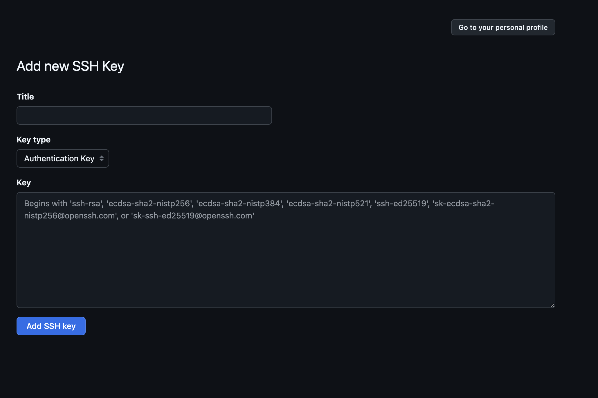
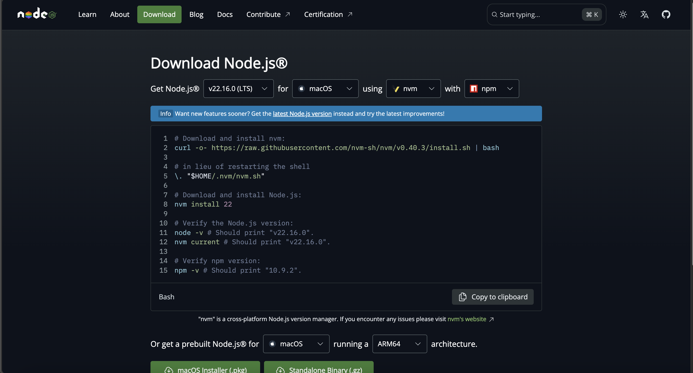

# How-to-configure-your-MacBook

暑期正逢入学季与毕业季，肯定有很多购入新电脑的同学，MacBook以其时尚的外形受到很多人的亲睐（我一直很想要但是财力所限加上不好意思和父母提起，直到大学的最后一年才入手一个），但是其类Unix系统在使用中对新手来说并不是很友好。诚然对大部分工科学生来说MacBook是一个不好的选择，因为有很多工科软件并没有对Mac进行适配。但是对cs科班的学生来说，选择了Mac，就选择了更丰富的大学生活：Enjoy the process of configuring your personal computer！（如果从大一就有一台Mac我会不会变成computer science高手？）
我们激活好电脑，进行了一系列基础配置后，我们就要开始配置如下的几类基础的模块：包管理器、集成开发环境、数据库软件、版本控制软件、网络软件。
## clash
这个不过多赘述，是一个程序员必备的东西，怎么下载怎么用哪里都能查到。
## Homebrew
Homebrew是一个Linux和Unix上的包管理器，很显然Mac的App Store里面关于开发的软件很少，这并不意味着我们不能用它进行开发，因为Mac并不限制你从第三方网站下载软件，而第三方软件浩如烟海，出于程序员的洁癖，我们很想要一个工具使我们能够管理这些第三方CLI软件或是GUI软件，Homebrew就有了用武之地。它让你能够便捷地安装、更新和管理各种软件包。
首先打开系统的terminal，我们要安装 Command Line Tools，在终端里输入：
~~~ 
xcode-select --install 
~~~
安装方式我们有如下的两个选择：
* 官方安装方式
~~~
/bin/bash -c "$(curl -fsSL https://raw.githubusercontent.com/Homebrew/install/HEAD/install.sh)"
~~~
* 国内源
~~~
/bin/bash -c "$(curl -fsSL https://raw.githubusercontent.com/Homebrew/install/HEAD/install.sh)"
~~~
当然还可以git克隆安装，但是我使用这个方法的次数并不多。我推荐使用第二种方法，因为第一种方法我在安装过程中就算开了代理，也会报错：
~~~
curl: (7) Failed to connect to raw.githubusercontent.com port 443: Connection refused
~~~
这是由于国内的Great Wall存在导致的。所以我们索性减少麻烦，选一个靠谱的安装吧～，安装的过程没什么可以介绍的，是一个对用户友好的TUI脚本，无非是选择安装源，选择是否覆盖旧版本之类。安装好了输入‘brew -v’，如果版本显示出来了就证明我们已经成功安装。我们可以通过‘brew config’命令查看我们的下载源在哪里，按理说我们选择了第二个下载方式是不需要换源的，如果不是镜像源，还是要利用bash命令或者zsh将新的源写入。
注意：MacOS的Homebrew默认路径在：‘opt/Homebrew’。
## iTerm2 and oh-my-zsh
Mac自带的terminal确实功能强大，但是我并不喜欢，功能与美观还是太少了，iTerm2有丰富的个性化，oh-my-zsh有功能更强大的插件，有哪个程序员会嫌个性化不够呢？我们来火速安装一下～
我们可以在官网直接安装它，也可以选择在Homebrew安装，都很简单：
首先搜索一下我们要安装的软件：
~~~
brew search iTerm2
~~~
我们会得到如下的输出：
~~~
==> Formulae
term
==> Casks
iterm2              iterm2@beta         iterm2@nightly      itermai
~~~
Formulae是指CLI软件，即：Command Line Interface，而Casks是指GUI软件，即：Graphical User Interface，我们这里要安装的是Casks的第一个软件。所以直接这样就可以了：
~~~
brew install --cask iterm2
~~~
接下来：
配置iTerm2为默认终端：右上角状态栏里iTerm2-->Make iTerm2 default Term
设置主题：右上角状态栏里iTerm2-->Settings-->Profiles，里面的text、colors、window可以设置丰富的个性化主题。如下这是我的主题：

iTerm2可以启用分屏，用cmd D和cmd shift D分别启用水平分屏与横向分屏，它有如下常用的快捷键：

新建标签页：Cmd + T
关闭标签页：Cmd + W
切换标签页：Cmd + 数字键 或 Cmd + 左右方向键
查找历史命令：Cmd + R
快速预览剪贴板内容：Cmd + Shift + V

oh-my-zsh就是一个美化工具，我们安装之前需要安装wget：
~~~
brew install wget
~~~
我们先把默认shell切换为zsh：
~~~
# 切换到zsh
chsh -s /bin/zsh
~~~
输入密码之后你会发现这个命令没什么必要，输出‘chsh: no changes made’，因为Mac的默认shell已经是zsh了。接下来我们进行安装，我们有如下两种安装方式：
~~~
# curl方法
sh -c "$(curl -fsSL https://raw.github.com/ohmyzsh/ohmyzsh/master/tools/install.sh)"

# wget方法
sh -c "$(wget -O- https://raw.githubusercontent.com/ohmyzsh/ohmyzsh/master/tools/install.sh)"
~~~
选择其一即可，我选择的就是第二种。如果你的代理没用，网络不好还是安装不了，那就用git直接拉取下来吧……下载好后，你就可以通过‘open ~/.zshrc’来编辑你的终端了。我修改了：
~~~
ZSH_THEME="apple"
plugins=(
	git
	zsh-autosuggestions
	zsh-syntax-highlighting
	zsh-completions
	fast-syntax-highlighting
)
~~~
其中不同的主题可以通过访问 https://github.com/ohmyzsh/ohmyzsh/wiki/Themes 看到，下载插件具体搜索一下就好了，用Homebrew或者直接git到软件的plugin文件夹即可，如：‘git clone git://github.com/zsh-users/zsh-autosuggestions $ZSH_CUSTOM/plugins/zsh-autosuggestions’。我们还可以编辑 ~/.zshrc 文件，添加以下 Git 别名：
~~~
alias ga='git add'
alias gc='git commit'
alias gp='git push'
alias gl='git log --oneline --graph --all'
~~~
这样可以更加方便我们进行日常工作。通过Homebrew、iTerm2和Oh-My-Zsh 的组合使用，可以极大地提升Mac的终端效率和开发体验，这些工具都能帮助你实现更高效的工作流程。
# vs code
做开发就不能少了世界上最好的IDE：vs code，我一般用这个软件处理Python开发、Cpp开发和前端开发，可以说是神中神。
下载地址：https://code.visualstudio.com/
我下载了如下的插件：
snapcode：这是一个可以获得漂亮代码截图的插件。
C/C++ Extension Pack：Cpp的环境插件，因为我们下载了xcode的一些工具gcc、g++，clang都包含了所以简单的项目不需要过多考虑这些。我们后期可以继续探讨。
python：python的运行环境
Chinese (Simplified) (简体中文) Language Pack：汉化不得不装。
Code Runner：运行代码的插件。
Cloudmusic：摸鱼，不得不摸。
background：个性化，必须装上。

这就是我美丽的vscode，工欲善其事，必先利其器，没有一个漂亮的工具你的coding也是不舒服的。
当然我们的Mac系统自带python，不过这个python我们不想用，我还是觉得用miniconda比较好。

~~~
brew install miniconda
~~~
环境变量，应该是无需手动配置的。然后创建一个虚拟环境，’conda create --name‘之类的，在vscode的设置里面配置一下默认解释器，这都是很简单的。到现在为止你已经可以享受基础的coding乐趣了，mba的这个键盘屏幕和重量确实让我很爱啊（绝对不是因为我喜欢躺在床上写东西）。
# git
git是版本控制工具，也是一个很重要的东西，有了它我们可以push很多自己的东西到GitHub上面，这是有利于我们能力加强的。经过上述步骤，我们电脑里已经有了git，输入‘git -v’是有输出的，然后我们将git（即本地物理机）-GitHub联系起来：
~~~
git config --global user.name  "你的简称"
git config --global user.email "你的邮箱"
git config --global push.default simple
git config -l
~~~
这是对本机的基础设置，我们最后一行的输出，如果设置是正确的，则进行下一步，生成ssh相关的密钥
~~~
ssh-keygen -t rsa -C  "你上一步设置的邮箱"
~~~
一直回车 ,回车到啥也不出为止,然后打开 id_rsa.pub 这个文件，然后打开github ,登录好你的账号如下：

在设置中找到ssh相关内容，add new keys，Title可以随便设置，将文件内容完整复制到下方的框中，在终端输入如下内容：

~~~
ssh git@github.com
~~~
如果输出是：Hi XXX！You‘ve ……，那么就设置成功了。
# nodepad--
我们既然要编程就不能缺少一个合适的功能强大的文本编辑器，系统自带的文本编辑有点落后了，市面上优秀的文本编辑很多，notepad++、sublime txt、notepad--，但是sublime txt需要不小的花费，虽然有破解版，但是我不太喜欢用，毕竟安装的时候要跳过mac的验证，你怎么知道他会不会留后门呢。而notepad++因为作者在应用中发表的涉及香港与台湾的言论，我强烈地拒绝使用这个应用，所以我们用它的国内替代notepad--，不仅免费同样也有强大的代码对比功能。我觉得这是个很好的替代。我们通过 https://gitee.com/cxasm/notepad--/releases/tag/v2.10 下载Notepad--v2.10.0-mac_x64_12.3.dmg，但是你下载好打开之后会提示“Mac安装软件的“已损坏，无法打开。 您应该将它移到废纸篓”，我们输入：
~~~
sudo xattr -r -d com.apple.quarantine /Applications/YourApplicationName.app
~~~
输入密码后就可以正常使用了。
# node
接下来我们进入最重要的java工程的配置，我们一般需要配置node、maven、jdk、tomcat，集成开发环境选择Idea，如果有小程序开发需求，我们可以安装webstorm，这都有非商业免费版。
首先我们配置node，我们前往官方网站， https://nodejs.org/en/ 。

选择你合适版本的，用npm -v与node -v验证你安装是否成功，一般而言都是没有问题的。

# maven
首先搜索maven版本：
~~~
brew search maven
~~~
安装之：
~~~
brew install maven@3.5
~~~
环境变量替换之：
~~~
If you need to have maven@3.5 first in your PATH, run:
echo 'export PATH="/usr/local/opt/maven@3.5/bin:$PATH"' >> /Users/xxx/.zshrc
~~~
如果安装成功，最后确认一下安装是否成功：mvn -v 。
最后一个确认命令会输出：
~~~
Apache Maven 3.9.9 (8e8579a9e76f7d015ee5ec7bfcdc97d260186937)
Maven home: /opt/homebrew/Cellar/maven/3.9.9/libexec
Java version: 23.0.2, vendor: Homebrew, runtime: /opt/homebrew/Cellar/openjdk/23.0.2/libexec/openjdk.jdk/Contents/Home
Default locale: zh_CN_#Hans, platform encoding: UTF-8
OS name: "mac os x", version: "15.5", arch: "aarch64", family: "mac"
~~~
我们直接找到路径下的libexec文件夹，进一步找到：conf/settings.xml，在mirror前配置如下内容：
~~~
<mirror>
		<id>alimaven</id>
		<name>aliyun maven</name> 
		<url>http://maven.aliyun.com/nexus/content/groups/public/</url> 
		<mirrorOf>central</mirrorOf>
</mirror>
然后在idea的设置里面配置路径即可
~~~
添加了国内的阿里源，如此我们的maven工具安装完成了。
# tomcat
我的主业不是java开发，所以tomcat我不是很懂有没有过时，但是我一般用springboot构建项目，而且我们可以看到springboot内部嵌入了tomcat，在spring-boot-starter-web里可以找到这个配置，所以我不确定这个配置是否必要，但是我们的web课程上提到了这一点，所以如果我们有需要，就可以看这篇文章配置一下 https://blog.csdn.net/qq_43921353/article/details/129102416 。
# jdk
jdk是我们开发最重要的工具，安装很简单，oracle 官方网站找到合适的版本直接下载包安装就好了，然后打开idea，在左上角：文件-->文件结构里面设置你所需要的jdk版本即可。
# 还有一些集成开发环境推荐
如果你喜欢idea系列开发工具的风格，你可以使用clion来进行C/Cpp开发，还有Xcode，这是Apple平台的一个开发工具，可以进行iPhone应用与Mac应用开发，这个如果有需求也可以下载。
# docker
直接在官网下载无脑配置就好了。
# navicat lite
navicat lite 是一个免费的管理数据库的图形化版本。
# mysql
我们可以在docker中配置mysql。

