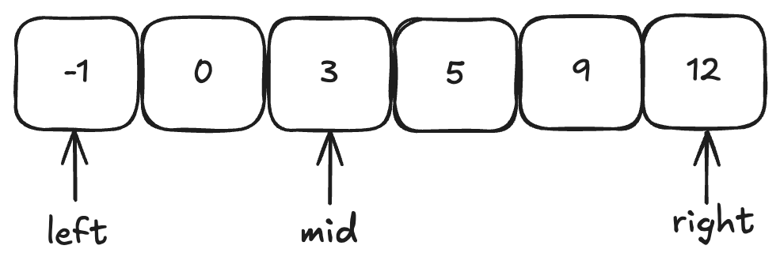

# 数组

数组是存放在连续内存空间上的相同类型数据的集合。可以方便的通过下标索引的方式获取到下标对应的数据。而且值得注意的是，数组的元素不可删除，只可以覆盖。
对于数组类题目我们有如下的做题技巧：

## 1.二分法

例题：输入: nums = [-1,0,3,5,9,12], target = 9     输出: 4



最需要注意的是闭区间还是左闭右开区间，这时候判断条件会发生变化。

```c++
#include<iostream>
#include<vector>
using namespace std;
//以闭区间为例
int search(vector<int>& v,int target){
	int left=0;
  int right=v.size()-1;
  while(left<=right){
    int mid=left+(right-left)/2;
		if(v[mid]<target){
			left=mid+1;
    }else if(v[mid]==target){
			return mid;
    }else{
			right=mid-1;
    }
  }
  return -1;
}
int main(){
  vector<int> v{-1,0,3,5,9,12};
  int target=9;
  cout<<search(v,target);
}
```

定义了什么样的区间，决定了我们使用什么样的边界条件。

## 2.双指针

 双指针法（快慢指针法）：**通过一个快指针和慢指针在一个for循环下完成两个for循环的工作。**

双指针法（快慢指针法）在数组和链表的操作中是非常常见的，很多考察数组和链表操作的面试题，都使用双指针法。

例题：给你一个数组nums和一个值val，你需要原地移除所有数值等于val的元素，并返回移除后数组的新长度。

```c++
#include<iostream>
#include<vector>
using namespace std;

int removeElement(vector<int>& v,int num){
	 int slowIndex = 0;
   for (int fastIndex = 0; fastIndex < nums.size(); fastIndex++) {
        if (val != nums[fastIndex]) {
            nums[slowIndex++] = nums[fastIndex];
          	//slowIndex++;
        }
  }
  return slowIndex;
}

int main(){
	vector<int>nums={3,2,2,3};
  int val=3;
  int newLength=removeElement(nums,val);
  cout<<newLength;
}
```

- `fastIndex` 是遍历指针，用于检查当前元素是否等于 `val`。
- 如果 `nums[fastIndex] != val`，说明这个元素应该保留，于是将其复制到 `nums[slowIndex]`，然后 `slowIndex++`（因为新数组的长度增加了）。
- 这里只有当 `nums[fastIndex]` 不是要删除的值时，才会执行 `nums[slowIndex++] = nums[fastIndex]`。
- `slowIndex++` 是一个 **后置递增**，意味着：
  - 先执行 `nums[slowIndex] = nums[fastIndex]`（复制元素）
  - 然后 `slowIndex` 自增 1（指向下一个位置）
  - 代码也可以变成`nums[slowIndex] = nums[fastIndex];`slowIndex++;`
- 最后返回`slowIndex`就是所求数组的长度

例题：给你一个按 非递减顺序排序的整数数组nums，返回每个数字的平方组成的新数组，也按非递减顺序排序。

```c++
#include<iostream>
#include<vector>
using namespace std;
vector<int> sortedSquares(vector<int>& nums){
	int n = A.size();
  vector<int> result(n);
  int left = 0, right = n - 1;
  for (int i = n - 1; i >= 0; --i){
      if (abs(A[left]) > abs(A[right])) {
         result[i] = A[left] * A[left];
         left++;
    } else {    
         result[i] = A[right] * A[right];
         right--;
   }
 }
  return result;
}

int main(){
	vector<int>nums{-6,1,2,3,4,5};
  vector<int> result=sortedSquares(nums);
  for(int i=0;i<result.size();i++){
        cout<<result[i]<<" ";
  }
  return 0;
}
```


## 3.滑动窗口

主要要理解滑动窗口如何移动 窗口起始位置，达到动态更新窗口大小的，从而得出长度最小的符合条件的长度。

**滑动窗口在于根据当前子序列和大小的情况，不断调节子序列的起始位置。从而将时间复杂度降低。**

### **滑动窗口的核心思想**：

1. **维护一个窗口**（通常由 `left` 和 `right` 指针表示），在数组中动态调整窗口的大小。
2. **移动 `right` 指针** 扩展窗口，直到满足某个条件（比如 `sum >= s`）。
3. **移动 `left` 指针** 收缩窗口，尝试找到更优的解（比如更小的子数组长度）。
4. **记录最优解**（比如 `minLength`）。

### **滑动窗口适用场景**：

- 通常用于 **连续子数组/子串** 问题（如求最小长度、最大长度、满足条件的子数组等）。
- 时间复杂度通常为 **O(n)**，因为每个元素最多被 `left` 和 `right` 指针各访问一次。

例题：给定一个含有 n 个正整数的数组和一个正整数 s ，找出该数组中满足其和 ≥ s 的长度最小的连续子数组，并返回其长度。如果不存在符合条件的子数组，返回 0。

```c++
#include<iostream>
#include<vector>
using namespace std;

int ministring(vector<int>& v,int s){
	  int n=nums.size();
    int left =0;
    int right=0;
    int sum=0;
    int minLength = n;
    while(right<n){
        sum+=nums[right];
        while(sum>=s){
            minLength = min(minLength, right - left + 1);
            sum -= nums[left];
            left++;
        }
        right++;
    }
    return minLength == n ? 0 : minLength;
}

int main(){
	  int n=6;
    int s=7;
    vector<int> nums{2,3,1,2,4,3}; // 示例输入
    int result = ministring(nums, s);
    cout << "最小长度的连续子数组的长度为: " << result << endl;
    cin.get();
    return 0;
}
```


## 4.模拟行为

不涉及算法，只是循环边界容易混乱

例题：给定一个正整数 n，生成一个包含 1 到 n^2 所有元素，且元素按顺时针顺序螺旋排列的正方形矩阵。

示例:输入: 3 输出: [ [ 1, 2, 3 ], [ 8, 9, 4 ], [ 7, 6, 5 ] ]

```c++
#include <iostream>
#include <vector>
using namespace std;
vector<vector<int>> generateMatrix(int n) {
    vector<vector<int>> matrix(n, vector<int>(n, 0));
    int left = 0, right = n - 1, top = 0, bottom = n - 1;
    int num = 1;
    while (left <= right && top <= bottom) {
        // 从左到右
        for (int i = left; i <= right; ++i) {
            matrix[top][i] = num++;
        }
        top++;
        // 从上到下
        for (int i = top; i <= bottom; ++i) {
            matrix[i][right] = num++;
        }
        right--;
        
        if (top <= bottom) {
            // 从右到左
            for (int i = right; i >= left; --i) {
                matrix[bottom][i] = num++;
            }
            bottom--;
        }
        
        if (left <= right) {
            // 从下到上
            for (int i = bottom; i >= top; --i) {
                matrix[i][left] = num++;
            }
            left++;
        }
    }
    return matrix;
}
int main()
{
    vector<vector<int>> matrix;
    int n = 3;
    matrix = generateMatrix(n);
    for (const auto& row : matrix) {
        for (int num : row) {
            cout << num << " ";
        }
        cout << endl;
    }
    return 0;
}
```


## 5.前缀和

前缀和的思路其实很简单，如，我们要统计 vec[i] 这个数组上的区间和。先做累加，即 p[i] 表示0到i的vec[i]累加之和。如果我们想统计在vec数组上，下标2下标5之间的累加和，用p[5] - p[1]就可以了。

例题：给定一个整数数组 Array，请计算该数组在每个指定区间内元素的总和。

输入描述：第一行输入为整数数组 Array 的长度 n，接下来 n 行，每行一个整数，表示数组的元素。随后的输入为需要计算总和的区间，直至文件结束。

输出描述：输出每个指定区间内元素的总和。

```c++
#include <iostream>
#include <vector>
using namespace std;
//前缀和
vector<int> prefixSum(const vector<int>& vec){
  vector<int> p;
  int sum = 0;
  for(int i=0;i<vec.size();i++){
		sum+=vec[i];
    p[i]=sum;
  }
  return p;
}
int main(){
	  int n, a, b;
    cin >> n;
    vector<int> vec(n);
    for (int i = 0; i < n; i++) {
        cin >> vec[i];
    }
    //利用前缀和数组要计算a到b的和，用前缀和对应相减即可
    vector<int> prefix = prefixSum(vec);
    while (cin >> a >> b) {
        // 输出前缀和数组中 b+1 和 a 的差值，即为区间 [a, b] 的和
        cout << prefix[b + 1] - prefix[a] << endl;
    }
}
```

例题：在一个城市区域内，被划分成了n * m个连续的区块，每个区块都拥有不同的权值，代表着其土地价值。目前，有两家开发公司，A 公司和 B 公司，希望购买这个城市区域的土地。现在，需要将这个城市区域的所有区块分配给 A 公司和 B 公司。然而，由于城市规划的限制，只允许将区域按横向或纵向划分成两个子区域，而且每个子区域都必须包含一个或多个区块。为了确保公平竞争，你需要找到一种分配方式，使得 A 公司和 B 公司各自的子区域内的土地总价值之差最小。

我们可以先将行方向，和列方向的和求出来，这样可以方便知道划分的两个区间的和。

```c++
#include<iostream>
#include<vector>
#include <algorithm>
#include <numeric>
#include <climits>
using namespace std;

vector<int> sumRow(vector<vector<int>>& grid){
	  vector<int> rowSums(grid.size(),0);
    for(int i=0;i<grid.size();i++){
        rowSums[i]= accumulate(grid[i].begin(), grid[i].end(), 0);
    }
    return rowSums;	
}

vector<int> sumCol(vector<vector<int>>& grid){
	  vector<int> colSums(grid[0].size(), 0);
    for(int j=0;j<grid[0].size();j++){
        for(int i=0;i<grid.size();i++){
            colSums[j] += grid[i][j];
        }
    }
    return colSums;
}

int main(){
	  vector<vector<int>> grid{{1,2,3},{1,2,3},{1,2,3}};
    vector<int> rowSums = calculateRowSums(grid);
    vector<int> colSums = calculateColSums(grid);
  	int sum=0;
    for (int i = 0; i < 3; i++) {
        for (int j = 0; j < 3; j++) {
            sum += grid[i][j];
        }
    }
    int result = INT_MAX;
    int horizontalCut = 0;
    for (int i = 0 ; i < 3; i++) {
        horizontalCut += rowSums[i];
        result = min(result, abs(sum - horizontalCut - horizontalCut));
    }
    int verticalCut = 0;
    for (int j = 0; j < 3; j++) {
        verticalCut += colSums[j];
        result = min(result, abs(sum - verticalCut - verticalCut));
    }
    cout << result << endl;
}
```

假设网格：

```txt
1 2 3
1 2 3
1 2 3
```

- **`sum = 18`**（整个网格的总和）。
- **水平切割**：
  - **切割第 1 行后**：
    - `horizontalCut = 第1行的和 = 6`（上半部分）。
    - 差值 = `|18 - 2 × 6| = 6`。
  - **切割第 2 行后**：
    - `horizontalCut = 第1行 + 第2行 = 12`（上半部分）。
    - 差值 = `|18 - 2 × 12| = 6`。
  - **切割第 3 行后**：
    - `horizontalCut = 第1行 + 第2行 + 第3行 = 18`（上半部分）。
    - 差值 = `|18 - 2 × 18| = 18`。
  - **最小水平切割差值 = 6**。
- **垂直切割**：
  - **切割第 1 列后**：
    - `verticalCut = 第1列的和 = 3`（左半部分）。
    - 差值 = `|18 - 2 × 3| = 12`。
  - **切割第 2 列后**：
    - `verticalCut = 第1列 + 第2列 = 9`（左半部分）。
    - 差值 = `|18 - 2 × 9| = 0`。
  - **切割第 3 列后**：
    - `verticalCut = 第1列 + 第2列 + 第3列 = 18`（左半部分）。
    - 差值 = `|18 - 2 × 18| = 18`。
  - **最小垂直切割差值 = 0**。

### 5. **最终结论**

- **最小差值 = 0**（来自垂直切割第 2 列）。
- **`sum - horizontalCut - horizontalCut` 的作用**：
  - 衡量当前切割方式下，两个子区域的价值差距。
  - 目标是让这个值尽可能小，使得分配更公平。
