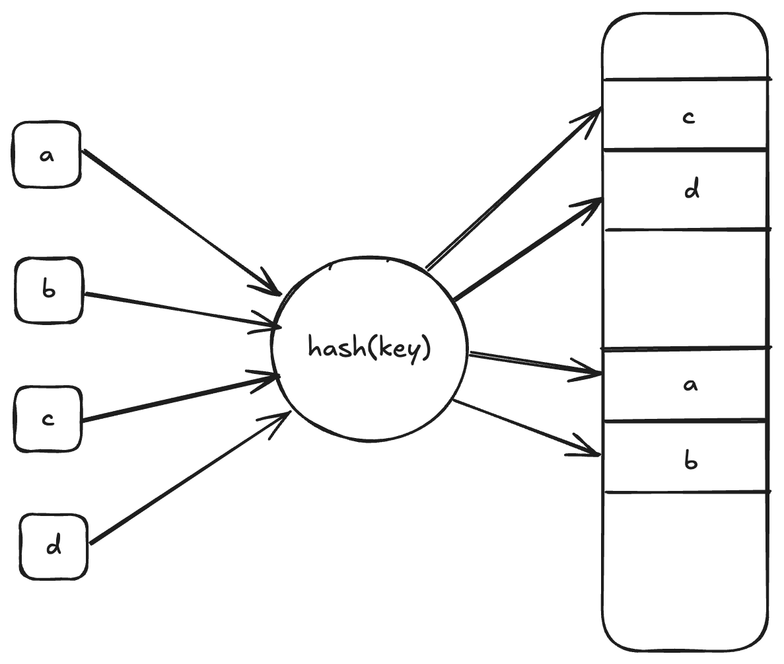
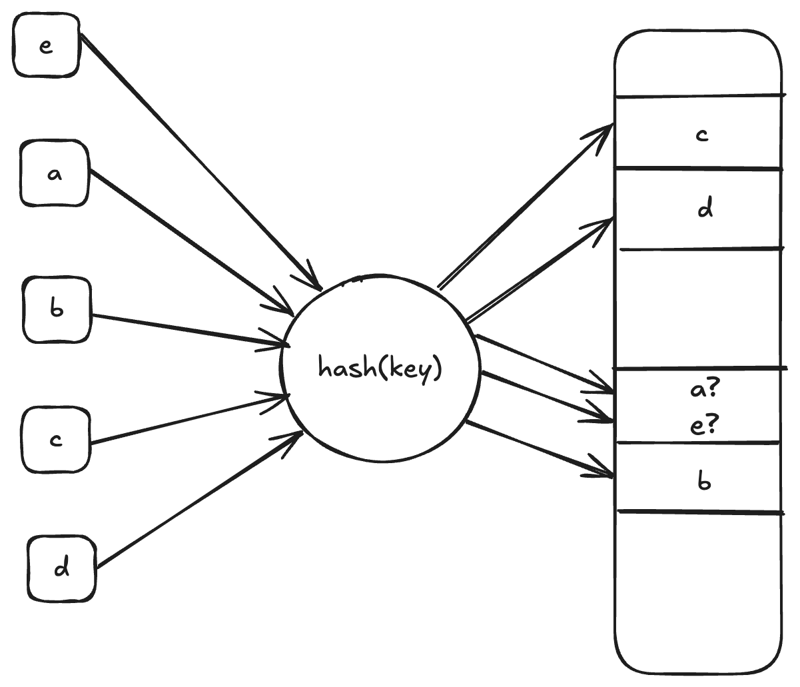
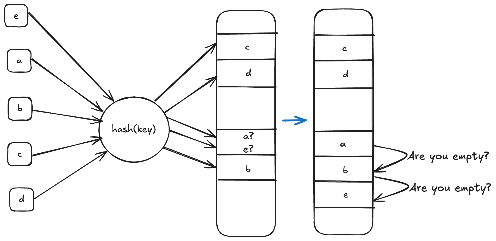
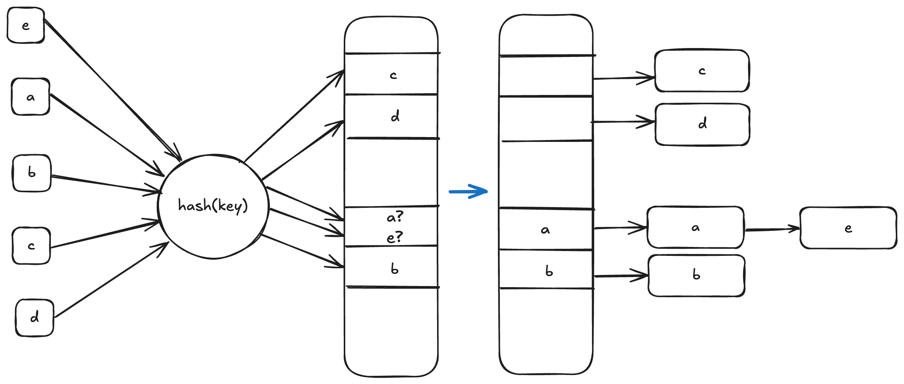
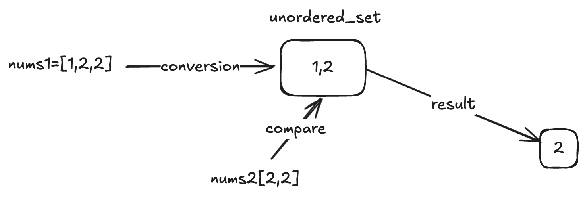
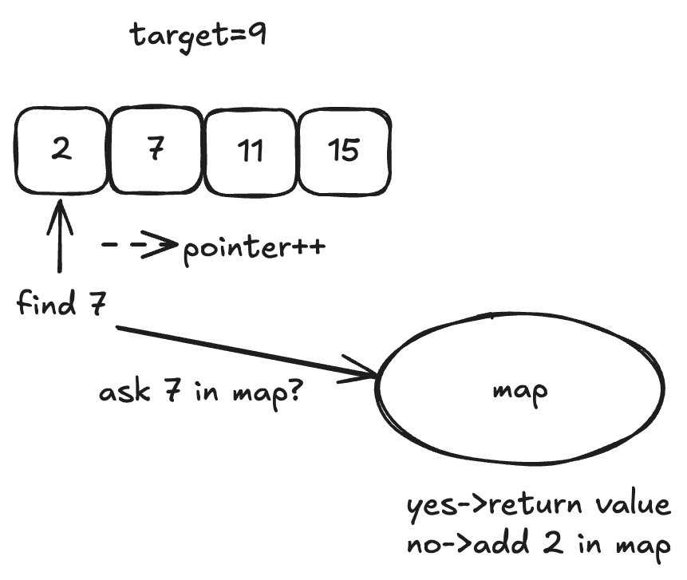

# 哈希表

## 1.哈希表定义

哈希表就是一个根据关键码的值而直接进行访问的数据结构。**一般哈希表都是用来快速判断一个元素是否出现集合里。**例如要查询一个数字是否在这个集合里面。要枚举的话时间复杂度是O(n)，但如果使用哈希表的话， 只需要O(1)就可以做到。我们只需要初始化把这数字都存在哈希表里，在查询的时候通过索引直接就可以知道某个数字在不在这所学校里了。将一个元素映射到哈希表上就涉及到了**hash function ，也就是哈希函数**。



这就是一个哈希函数，通过hashCode把名字转化为数值，一般hashcode是通过特定编码方式，可以将其他数据格式转化为不同的数值。如果hashCode得到的数值大于哈希表的大小了，此时为了保证映射出来的索引数值都落在哈希表上，我们会在再次对数值做一个取模的操作，这样我们就保证了元素一定可以映射到哈希表上了。此时。如果学生的数量大于哈希表的大小怎么办，此时就算哈希函数计算的再均匀，也避免不了会有几位学生的名字同时映射到哈希表 同一个索引下标的位置。这就导致了哈希冲突。



我如何对a和e进行安排呢，这里有两种方法，一种是线性探测，就是一个一个问后面是否有空格，找到一个空的位置就把e塞进去就好了：



还有一种叫拉链法，就是变成一个链表：



除此之外还有二次探测，双哈希等等方法，这个在这里不是重点。

当我们想使用哈希法来解决问题的时候，我们一般会选择如下三种数据结构：数组、set、map。

在C++中，set 和 map 分别提供以下三种数据结构，其底层实现以及优劣如下表所示：

| set                | 底层实现 | 是否有序 | 数值是否可以重复 | 能否更改数值 | 查询效率 | 增删效率 |
| ------------------ | -------- | -------- | ---------------- | ------------ | -------- | -------- |
| std::set           | 红黑树   | 有序     | 否               | 否           | O(log n) | O(log n) |
| std::multiset      | 红黑树   | 有序     | 是               | 否           | O(logn)  | O(logn)  |
| std::unordered_set | 哈希表   | 无序     | 否               | 否           | O(1)     | O(1)     |

| map                | 底层实现 | 是否有序 | 数值是否可以重复 | 能否更改数值 | 查询效率 | 增删效率 |
| ------------------ | -------- | -------- | ---------------- | ------------ | -------- | -------- |
| std::map           | 红黑树   | key有序  | key不可重复      | key不可修改  | O(logn)  | O(logn)  |
| std::multimap      | 红黑树   | key有序  | key可重复        | key不可修改  | O(log n) | O(log n) |
| std::unordered_map | 哈希表   | key无序  | key不可重复      | key不可修改  | O(1)     | O(1)     |

std::unordered_map 底层为哈希表，std::map 和std::multimap 的底层是红黑树。当我们要使用集合来解决哈希问题的时候，优先使用unordered_set，因为它的查询和增删效率是最优的，如果需要集合是有序的，那么就用set，如果要求不仅有序还要有重复数据的话，那么就用multiset。

map 是一个key value 的数据结构，map中，对key是有限制，对value没有限制的，因为key的存储方式使用红黑树实现的。

虽然std::set和std::multiset 的底层实现基于红黑树而非哈希表，它们通过红黑树来索引和存储数据。不过给我们的使用方式，还是哈希法的使用方式，即依靠键（key）来访问值（value）。所以使用这些数据结构来解决映射问题的方法，我们依然称之为哈希法。std::map也是一样的。

有时候我们会遇到hash_set hash_map，这个与unordered_set，unordered_map又有什么关系？

实际上功能都是一样的， 但是unordered_set在C++11的时候被引入标准库，而hash_set并没有。

例题：哈希表线性探测，哈希函数f=x%n，长度为n的数组用于存储x值，需要哈希表插入一个值x时，从数组的下标f开始向右循环移动，找到第一个未存储过数字的位置写入x，若哈希表满或者x在，则不插入。

输入：n个整数

输出：合法的序列个数

这就是个数组的问题，我们这样实现它：

```c++
#include <iostream>
#include <vector>
using namespace std;

vector<int> hashTable(vector<int> &nums, int n) {
    vector<int> table(n, 0);  // 初始化为0
    vector<int> result;
    
    for(int x : nums) {
        int f = x % n;  // 哈希函数
        int j = f;
        bool inserted = false;
        
        // 线性探测
        do {
            if(table[j] == 0) {  // 找到空位
                table[j] = x;
                result.push_back(x);
                inserted = true;
                break;
            } else if(table[j] == x) {  // 已存在
                break;
            }
            j = (j + 1) % n;  // 循环移动
        } while(j != f);  // 回到起点说明表满
        
        if(!inserted) {
            // 当前元素未插入，但继续处理下一个元素
            continue;
        }
    }
    
    return table;
}

int main() {
    int n;  // 哈希表大小
    cin >> n;
    vector<int> nums(n);
    for(int i = 0; i < n; i++) {
        cin >> nums[i];
    }
    
    vector<int> result = hashTable(nums, n);
    for(int num : result) {
        cout << num << " ";
    }
    cout << endl;
    cin.get();
    cin.get();  // 等待输入，防止程序直接退出
    return 0;
}
```

我们这就实现了一个简单的哈希表。

## 2.有效的字母异位词

给定两个字符串 s 和 t ，编写一个函数来判断 t 是否是 s 的字母异位词。

示例 1: 输入: s = "anagram", t = "nagaram" 输出: true

示例 2: 输入: s = "rat", t = "car" 输出: false

**说明:** 你可以假设字符串只包含小写字母。

也就是判断t中的字符是否都在s中，这就用到我们构造出来的哈希表。

```c++
#include<iostream>
#include<vector>
using namespace std;
bool isSame(string s,string t){
    vector<int> hashTable(26, 0); // 假设哈希表大小为26，存储字母出现次数
    if(s.size()!=t.size())return false;
    for(int i=0;i<s.size();i++){
        hashTable[s[i]-'a']++; // 统计nums1中每个字母的出现次数
        hashTable[t[i]-'a']--; // 统计nums2中每个字母的出现次数
    }
    for(int i=0;i<26;i++){
        if(hashTable[i]!=0)return false; // 如果有字母出现次数不相等，则不是同构字符串
    }
    return true; // 所有字母出现次数相等，则是同构字符串
}
int main(){
    string s="aee";
    string t="eae";
    //cin>>s>>t;
    if(isSame(s,t)){
        cout<<"true"<<endl;
    }else{
        cout<<"false"<<endl;
    }
    return 0;
}
```

## 3.两个数组交集

例题：给定两个数组，编写一个函数来计算它们的交集。

这道题目，主要要学会使用一种哈希数据结构：unordered_set，这个数据结构十分重要，可以解决很多类似的问题。

为什么这里不用vector做哈希呢，我们要注意，使用数组做哈希的一般题目里面都明确限制了数值的大小，这里很分散，跨度大，不明确，无法使用数组来创建哈希表。



由图我们可以写出代码如下：

```c++
#include<iostream>
#include<unordered_set>
#include<vector>
using namespace std;
vector<int> arrayMeet(vector<int>& nums1, vector<int>& nums2){
    unordered_set<int>result;
    unordered_set<int>set1(nums1.begin(), nums1.end());
    for (int num : nums2) {
            // 发现nums2的元素 在set1里又出现过
            if (set1.find(num) != set1.end()) {
                result.insert(num);
            }
        }
        return vector<int>(result.begin(), result.end());
}
int main(){
    vector<int> nums1 = {1, 2, 3, 4, 5};
    vector<int> nums2 = {4, 5, 6, 7, 8};
    vector<int> result = arrayMeet(nums1, nums2);
    for (int num : result) {
        cout << num << " ";
    }
    cout << endl;
    return 0;
}
```


## 4.快乐数

编写一个算法来判断一个数 n 是不是快乐数。快乐数定义为：对于一个正整数，每一次将该数替换为它每个位置上的数字的平方和，然后重复这个过程直到这个数变为 1，也可能是 无限循环 但始终变不到 1。如果 可以变为 1，那么这个数就是快乐数。如果 n 是快乐数就返回 True ；不是，则返回 False 。

**示例：**

输入：19
输出：true
解释：
1^2 + 9^2 = 82
8^2 + 2^2 = 68
6^2 + 8^2 = 100
1^2 + 0^2 + 0^2 = 1

```c++
#include<iostream>
#include<vector>
#include<unordered_set>
using namespace std;
// 判断一个数是否是快乐数
bool ishappy(int n){
  	unordered_set<int>set;
    while(1){
        int sum=0;
        while(n){
            sum+= (n%10)*(n%10); // 计算每位数字的平方和
            n /= 10; // 去掉最后一位数字
        }
        //unordered_set<int> set;
        if(sum==1){
            return true;
        } // 如果平方和为1，则是快乐数
        // 如果平方和已经出现过，说明陷入循环，不是快乐数
        if(set.find(sum)!=set.end()){
            return false;
        }
        else {
            set.insert(sum); 
        }// 将当前的平方和加入集合
        n = sum; // 更新n为平方和，继续计算
    }
}
int main(){
    int n=19;
    if(ishappy(n)){
        cout<<"true"<<endl; // 如果是快乐数，输出true
    }else{
        cout<<"false"<<endl; // 如果不是快乐数，输出false
    }
    return 0;
}
```


## 5.两数之和

给定一个整数数组 nums 和一个目标值 target，请你在该数组中找出和为目标值的那 两个 整数，并返回他们的数组下标。你可以假设每种输入只会对应一个答案。但是，数组中同一个元素不能使用两遍。

**示例:**

给定 nums = [2, 7, 11, 15], target = 9

因为 nums[0] + nums[1] = 2 + 7 = 9

所以返回 [0, 1]

这题的关键在于如何想到使用哈希表、为什么使用map、map的作用是存储什么内容的。当我们需要查询一个元素是否出现过，或者一个元素是否在集合里的时候，就第一时间想到哈希。本题就需要一个集合来存放我们遍历过的元素，然后在遍历数组的时候去询问这个集合，某元素是否遍历过。但是本题我们不仅要知道元素有没有遍历过，还要知道这个元素对应的下标，**需要使用 key value结构来存放，key来存元素，value来存下标，那么使用map正合适**。

数组和集合两个容器做哈希是有限制的：

- 数组的大小是受限制的，而且如果元素很少，而哈希值太大会造成内存空间的浪费。如果题目中没有明确的范围给出，我们不能用数组创建哈希，不然会造成严重的空间浪费。
- set是一个集合，里面放的元素只能是一个key，而对于要判断y是否存在而且还要记录y的下标位置的题目，set 也不能用。

map目的是用来存放我们访问过的元素，因为遍历数组的时候，需要记录我们之前遍历过哪些元素和对应的下标，这样才能找到与当前元素相匹配的数字。那么判断元素是否出现，这个元素就要作为key，所以数组中的元素作为key，value用来存下标。所以 map中的存储结构为 {key：数据元素，value：数组元素对应的下标}。在遍历数组的时候，只需要向map去查询是否有和目前遍历元素匹配的数值，如果有，就找到的匹配对，如果没有，就把目前遍历的元素放进map中，因为map存放的就是我们访问过的元素。



```c++
#include<iostream>
#include<unordered_map>
using namespace std;
vector<int> twoSum(vector<int>& nums, int target){
    unordered_map<int,int> hashtable; // 哈希表存储数字及其索引
    vector<int> result; // 存储结果
    for(int i=0;i<nums.size();i++){
        int complement=target-nums[i];
        if(hashtable.find(complement)!=hashtable.end()){
            // 如果哈希表中找到了补数
            result.push_back(hashtable[complement]); // 添加补数的索引
            result.push_back(i); // 添加当前数字的索引
            return result; // 返回结果
        }
        hashtable.insert(pair<int, int>(nums[i], i));
    }
    return result; // 如果没有找到，返回空结果
}
int main(){
    vector<int> nums={2,7,11,15};
    int target=9;
    vector<int> result=twoSum(nums,target);
    if(result.size()==0){
        cout<<"No two sum solution"<<endl; // 如果没有找到，输出提示
    }else{
        cout<<"Indices: "<<result[0]<<" "<<result[1]<<endl; // 输出找到的两个数的索引
    }
    return 0;
}
```

## 6.四数相加

给定四个包含整数的数组列表 A , B , C , D ,计算有多少个元组 (i, j, k, l) ，使得 A[i] + B[j] + C[k] + D[l] = 0。

为了使问题简单化，所有的 A, B, C, D 具有相同的长度 N，且 0 ≤ N ≤ 500 。所有整数的范围在 -2^28 到 2^28 - 1 之间，最终结果不会超过 2^31 - 1 。

**示例:**

输入:

- A = [ 1, 2]
- B = [-2,-1]
- C = [-1, 2]
- D = [ 0, 2]

输出: 2

**解释:**

两个元组如下:

1. (0, 0, 0, 1) -> A[0] + B[0] + C[0] + D[1] = 1 + (-2) + (-1) + 2 = 0
2. (1, 1, 0, 0) -> A[1] + B[1] + C[0] + D[0] = 2 + (-1) + (-1) + 0 = 0

我们来做一个小小的变形A[i] + B[j] + C[k] + D[l] = 0是不是就是A[i] + B[j] = -（C[k] + D[l]），所以我们只要把A和B的和放在map里面，然后用0-C-D去map里面撞这个值就可以了。

代码如下：

```c++
#include<iostream>
#include<unordered_map>
#include<vector>
using namespace std;
int fournumbers(vector<int>& A, vector<int>& B, vector<int>& C, vector<int>& D){
    unordered_map<int,int>map;
	//key:a+b的数值，value:a+b数值出现的次数
        // 遍历A和B数组，统计两个数组元素之和，和出现的次数，放到map中
    for (int a : A) {
       for (int b : B) {
          map[a + b]++;
       }
   }
	int count=0;//统计a+b+c+d出现的次数
	// 再遍历C和D数组，找到如果 0-(c+d) 在map中出现过的话，就把map中key对应的value也就是出现次数统计出来。
	for(int c:C){
		for(int d:D){
			if (map.find(0 - (c + d)) != map.end()) {
                    count += map[0 - (c + d)];
		}
	}
	
}
return count;
}
int main() {
    vector<int> A = {1, 2};
    vector<int> B = {-2, -1};
    vector<int> C = {-1, 2};
    vector<int> D = {0, 2};
    
    int result = fournumbers(A, B, C, D);
    cout << "The number of tuples (a, b, c, d) such that a + b + c + d = 0 is: " << result << endl;
    
    return 0;
}
```

## 7.赎金信

给定一个赎金信 (ransom) 字符串和一个杂志(magazine)字符串，判断第一个字符串 ransom 能不能由第二个字符串 magazines 里面的字符构成。如果可以构成，返回 true ；否则返回 false。

(题目说明：为了不暴露赎金信字迹，要从杂志上搜索各个需要的字母，组成单词来表达意思。杂志字符串中的每个字符只能在赎金信字符串中使用一次。)

**注意：**

你可以假设两个字符串均只含有小写字母。

canConstruct("a", "b") -> false
canConstruct("aa", "ab") -> false
canConstruct("aa", "aab") -> true

道题目是求字符串a能否组成字符串b，而不用管字符串b 能不能组成字符串a。非常重要的一点就是杂志里面的字母不可重复使用。我们可以想到如下思路，用一个长度为26的数组来记录magazine里字母出现的次数。然后再用ransom去验证这个数组是否包含了ransom所需要的所有字母。

```c++
#include<iostream>
#include<string>
using namespace std;
bool ransomNote(string ransom,string magazine){
	int record[26]={0};
	if(ransom.size()>magazine.size()){
		return false;
	}
	for(int i=0;i<magazine.size();i++){
		record[magazine[i]-'a']++;
	}
	for(int j=0;j<ransom.size();j++){
		record[ransom[j]-'a']--;
		if(record[ransom[j]-'a']<0){
			return false;
		}
	}
	return true;
}
int main(){
	string a="aa";
	string b="aab";
	cout<<ransomNote(a,b);
}
```

## 8.三数之和

给你一个包含 n 个整数的数组 nums，判断 nums 中是否存在三个元素 a，b，c ，使得 a + b + c = 0 ？请你找出所有满足条件且不重复的三元组。

**注意：** 答案中不可以包含重复的三元组。

示例：

给定数组 nums = [-1, 0, 1, 2, -1, -4]，

满足要求的三元组集合为： [ [-1, 0, 1], [-1, -1, 2] ]

两层for循环就可以确定 两个数值，可以使用哈希法来确定 第三个数 0-(a+b) 或者 0 - (a + c) 是否在 数组里出现过，但是难点在于去除重复的元素，把符合条件的三元组放进vector中，然后再去重，这样是非常费时的，很容易超时。

```c++
//hash解法
vector<vector<int>> findThreeNums(vector<int>nums){
	vector<vector<int>> result;
    sort(nums.begin(), nums.end());
	for(int i=0;i<nums.size();i++){
		if(nums[i]>0){
			break;
		}
		// [a, a, ...] 如果本轮a和上轮a相同，那么找到的b，c也是相同的，所以去重a
        if (i > 0 && nums[i] == nums[i - 1])
            continue;
            
        // 这个set的作用是存储b
        unordered_set<int> set;
            
        for (int k = i + 1; k < nums.size(); k++) {
            // 去重b=c时的b和c
            if (k > i + 2 && nums[k] == nums[k - 1] && nums[k - 1] == nums[k - 2])
                continue;
                
            // a+b+c=0 <=> b=0-(a+c)
            int target = 0 - (nums[i] + nums[k]);
            if (set.find(target) != set.end()) {
                result.push_back({nums[i], target, nums[k]});// nums[k]成为c
                set.erase(target);
            }
            else {
                    set.insert(nums[k]);// nums[k]成为b
            }
		}
	}
	return result;
}
```

其实这题应该用双指针方法效率比较高，首先将数组排序，然后有一层for循环，i从下标0的地方开始，同时定一个下标left 定义在i+1的位置上，定义下标right 在数组结尾的位置上。这里相当于 a = nums[i]，b = nums[left]，c = nums[right]。

接下来如何移动left 和right呢， 如果nums[i] + nums[left] + nums[right] > 0 就说明 此时三数之和大了，因为数组是排序后了，所以right下标就应该向左移动，这样才能让三数之和小一些。如果 nums[i] + nums[left] + nums[right] < 0 说明 此时 三数之和小了，left 就向右移动，才能让三数之和大一些，直到left与right相遇为止。

```c++
//双指针解法
vector<vector<int>> findThreeNums_01(vector<int>nums){
	vector<vector<int>> result;
    sort(nums.begin(), nums.end());
	for(int i=0;i<nums.size();i++){
		if(nums[i]>0){
			break;
		}
		// 错误去重a方法，将会漏掉-1,-1,2 这种情况
        /*
        if (nums[i] == nums[i + 1]) {
              continue;
        }
       */
       // 正确去重a方法
       if (i > 0 && nums[i] == nums[i - 1]) {
           continue;
       }
       int left = i + 1;
       int right = nums.size() - 1;
       while (right > left) {
       // 去重复逻辑如果放在这里，0，0，0 的情况，可能直接导致 right<=left 了，从而漏掉了 0,0,0 这种三元组
       /*
          while (right > left && nums[right] == nums[right - 1]) right--;
          while (right > left && nums[left] == nums[left + 1]) left++;
       */
       if (nums[i] + nums[left] + nums[right] > 0) right--;
       else if (nums[i] + nums[left] + nums[right] < 0) left++;
       else {
            result.push_back(vector<int>{nums[i], nums[left], nums[right]});
            // 去重逻辑应该放在找到一个三元组之后，对b 和 c去重
            while (right > left && nums[right] == nums[right - 1]) right--;
            while (right > left && nums[left] == nums[left + 1]) left++;

            // 找到答案时，双指针同时收缩
            right--;
            left++;
         }
      }

}
	return result;
}
```


## 9.四数之和的不重复版本

题意：给定一个包含 n 个整数的数组 nums 和一个目标值 target，判断 nums 中是否存在四个元素 a，b，c 和 d ，使得 a + b + c + d 的值与 target 相等？找出所有满足条件且不重复的四元组。

**注意：**

答案中不可以包含重复的四元组。

示例： 给定数组 nums = [1, 0, -1, 0, -2, 2]，和 target = 0。 满足要求的四元组集合为： [ [-1, 0, 0, 1], [-2, -1, 1, 2], [-2, 0, 0, 2] 

四个数之和的实现和三数之和一样，都用双指针做，在三数之和的基础上再套一层for循环。四数之和的双指针解法是两层for循环nums[k] + nums[i]为确定值，依然是循环内有left和right下标作为双指针，找出nums[k] + nums[i] + nums[left] + nums[right] == target的情况，三数之和的时间复杂度是O(n^2)，四数之和的时间复杂度是O(n^3) 。那么一样的道理，五数之和、六数之和等等都采用这种解法。

我们最后来统一一下写法：

```c++
#include<iostream>
#include<algorithm>
#include<vector>
using namespace std;
//两数和
vector<vector<int>> twoSum(vector<int>& nums, int target) {
    //给定一个整数数组 nums 和一个目标值 target
    //请你在该数组中找出和为目标值的那两个整数，并返回他们的值
    // nums = [1,2,3,4,3], target = 5
  	vector<vector<int>> result;
    sort(nums.begin(), nums.end());  // 先排序，方便双指针查找
    
    int left = 0;
    int right = nums.size() - 1;
    
    while (left < right) {
        int sum = nums[left] + nums[right];
        
        if (sum == target) {
            result.push_back({nums[left], nums[right]});  // 存储当前解
            
            // 跳过左侧重复元素
            while (left < right && nums[left] == nums[left + 1]) left++;
            // 跳过右侧重复元素
            while (left < right && nums[right] == nums[right - 1]) right--;
            
            left++;  // 继续查找
            right--;
        } 
        else if (sum < target) {
            left++;  // 和太小，左指针右移
        } 
        else {
            right--;  // 和太大，右指针左移
        }
    }
    
    return result;
}
//三数和
vector<vector<int>> threeSum(vector<int>& nums, int target){
    //给你一个包含 n 个整数的数组 nums，判断 nums 中是否存在三个元素 a，b，c 
    //使得 a + b + c = 0 ？请你找出所有满足条件且不重复的三元组
    //给定数组 nums = [-1, 0, 1, 2, -1, -4] target为2
    vector<vector<int>> result;
    sort(nums.begin(), nums.end());
    int n = nums.size();

    for (int i = 0; i < n - 2; i++) {
        if (i > 0 && nums[i] == nums[i - 1]) continue;  // 跳过重复的 nums[i]

        int left = i + 1, right = n - 1;
        int new_target = target - nums[i];

        while (left < right) {
            int sum = nums[left] + nums[right];
            if (sum == new_target) {
                result.push_back({nums[i], nums[left], nums[right]});
                // 跳过重复的 nums[left] 和 nums[right]
                while (left < right && nums[left] == nums[left + 1]) left++;
                while (left < right && nums[right] == nums[right - 1]) right--;
                left++;
                right--;
            } else if (sum < new_target) {
                left++;
            } else {
                right--;
            }
        }
    }
    return result;
}
//四数和
vector<vector<int>> fourSum(vector<int>& nums, int target){
    //给定一个包含 n 个整数的数组 nums 和一个目标值 target
    //判断 nums 中是否存在四个元素 a，b，c 和 d 
    //使得 a + b + c + d 的值与 target 相等？找出所有满足条件且不重复的四元组
    //给定数组 nums = [1, 0, -1, 0, -2, 2]，和 target = 0
    vector<vector<int>> result;
    sort(nums.begin(), nums.end());
    int n = nums.size();

    for (int i = 0; i < n - 3; i++) {
        if (i > 0 && nums[i] == nums[i - 1]) continue;  // 跳过重复的 nums[i]

        for (int j = i + 1; j < n - 2; j++) {
            if (j > i + 1 && nums[j] == nums[j - 1]) continue;  // 跳过重复的 nums[j]

            int left = j + 1, right = n - 1;
            int new_target = target - nums[i] - nums[j];

            while (left < right) {
                int sum = nums[left] + nums[right];
                if (sum == new_target) {
                    result.push_back({nums[i], nums[j], nums[left], nums[right]});
                    // 跳过重复的 nums[left] 和 nums[right]
                    while (left < right && nums[left] == nums[left + 1]) left++;
                    while (left < right && nums[right] == nums[right - 1]) right--;
                    left++;
                    right--;
                } else if (sum < new_target) {
                    left++;
                } else {
                    right--;
                }
            }
        }
    }
    return result;
}
int main(){
    vector<int>v1{1,2,3,4,3};
    int target1=5;
    vector<vector<int>>result1=twoSum(v1,target1);
    for(auto num1:result1){
        for(auto n1:num1){
            cout<<n1<<" ";
        }
        cout<<endl;
    }
    cout<<endl;

    vector<int>v2{-1, 0, 1, 2, 1, -2};
    int target2=2;
    vector<vector<int>>result2=threeSum(v2,target2);
    for(auto num2:result2){
        for(auto n2:num2){
            cout<<n2<<" ";
        }
        cout<<endl;
    }
    cout<<endl;

    vector<int>v3{1, 0, -1, 0, -2, 2};
    int target3=0;
    vector<vector<int>>result3=threeSum(v3,target3);
    for(auto num3:result3){
        for(auto n3:num3){
            cout<<n3<<" ";
        }
        cout<<endl;
    }
    cout<<endl;
}
```

