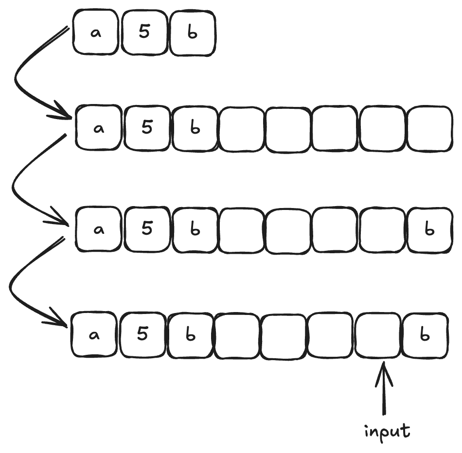
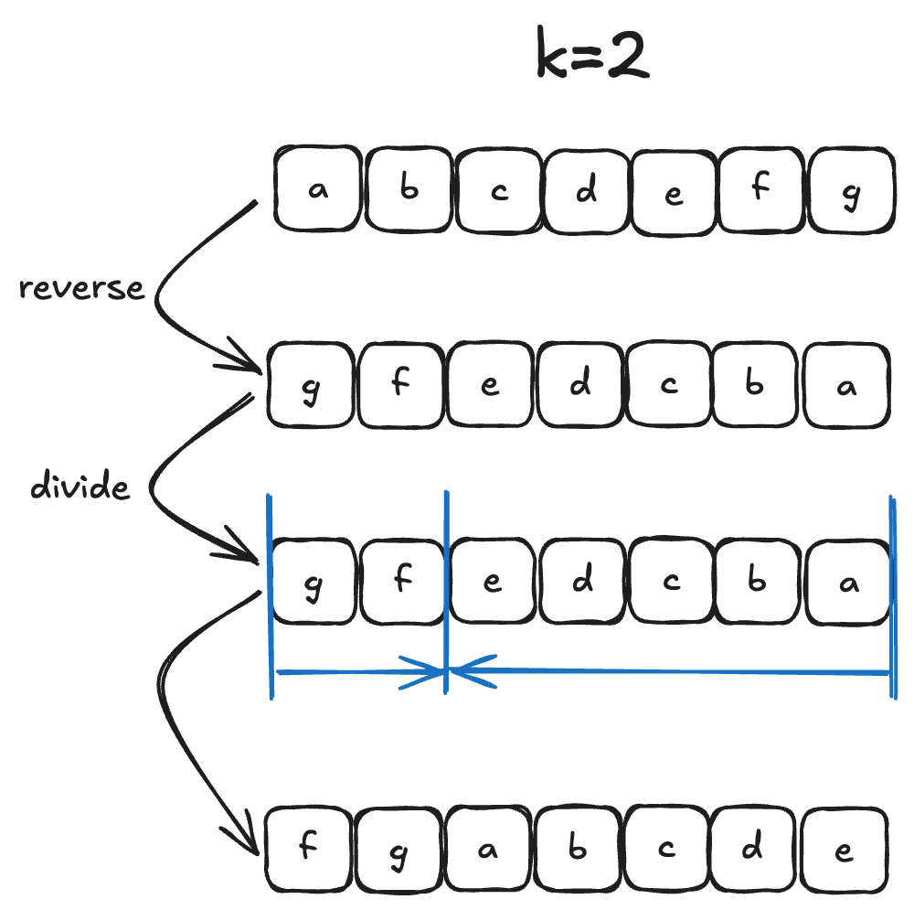

# 字符串

## 1.反转字符串

编写一个函数，其作用是将输入的字符串反转过来。不要给另外的数组分配额外的空间，你必须原地修改输入数组、使用 O(1) 的额外空间解决这一问题。你可以假设数组中的所有字符都是 ASCII 码表中的可打印字符。

```c++
#include<iostream>
#include<string>
using namespace std;
string reverseString(string s){
    int left=0;
    int right=s.size()-1;
    while(left<right){
        char temp;
        temp=s[left];
        s[left]=s[right];
        s[right]=temp;
        left++;
        right--;
    }
    return s;
}
int main(){
    string s="hello";
    cout<<reverseString(s);
} 
```

## 2.反转字符串02

给定一个字符串 s 和一个整数 k，从字符串开头算起, 每计数至 2k 个字符，就反转这 2k 个字符中的前 k 个字符。如果剩余字符少于 k 个，则将剩余字符全部反转。如果剩余字符小于 2k 但大于或等于 k 个，则反转前 k 个字符，其余字符保持原样。

示例:

输入: s = "abcdefg", k = 2
输出: "bacdfeg"

在遍历字符串的过程中，只要让 i += (2 * k)，i 每次移动 2 * k 就可以了，然后判断是否需要有反转的区间。因为要找的也就是每2 * k 区间的起点，这样写程序会高效很多.

```c++
#include<iostream>
#include<string>
using namespace std;
string reserveString(string s,int k){
    for(int i=0;i<s.size();i+=2*k){
        // 1. 每隔 2k 个字符的前 k 个字符进行反转
        // 2. 剩余字符小于 2k 但大于或等于 k 个，则反转前 k 个字符
        if (i + k <= s.size()) {
                reverse(s.begin() + i, s.begin() + i + k );
        } else {
                // 3. 剩余字符少于 k 个，则将剩余字符全部反转。
                reverse(s.begin() + i, s.end());
        }
    }
    return s;
}
int main(){
    string s="abcdefg";
    int k=2;
    cout<<reserveString(s,k);
}
```


## 3.替换数字

给定一个字符串 s，它包含小写字母和数字字符，请编写一个函数，将字符串中的字母字符保持不变，而将每个数字字符替换为number。

例如，对于输入字符串 "a1b2c3"，函数应该将其转换为 "anumberbnumbercnumber"。

对于输入字符串 "a5b"，函数应该将其转换为 "anumberb"

输入：一个字符串 s,s 仅包含小写字母和数字字符。

输出：打印一个新的字符串，其中每个数字字符都被替换为了number

样例输入：a1b2c3

样例输出：anumberbnumbercnumber 

```c++
#include<iostream>
#include<string>
using namespace std;

string replaceNum(string s) {
    int count = 0;
    for (char c : s) {
        if (isdigit(c)) {
            count++;
        }
    }
    
    int oldSize = s.size();
    s.resize(s.size() + count * 5);
    int oldIndex = oldSize - 1;
    int newIndex = s.size() - 1;
    
    while (oldIndex >= 0) {
        if (isdigit(s[oldIndex])) {
            s[newIndex--] = 'r';
            s[newIndex--] = 'e';
            s[newIndex--] = 'b';
            s[newIndex--] = 'm';
            s[newIndex--] = 'u';
            s[newIndex--] = 'n';
        } else {
            s[newIndex--] = s[oldIndex];
        }
        oldIndex--;
    }
    
    return s;
}

int main() {
    string s = "a1b2c3";
    string result = replaceNum(s);
    cout << result;  // 输出: anumberbnumbercnumber
}
```



## 4.翻转字符串的单词

给定一个字符串，逐个翻转字符串中的每个单词。**不要使用辅助空间，空间复杂度要求为O(1)。**

示例 1：
输入: "the sky is blue"
输出: "blue is sky the"

示例 2：
输入: "  hello world!  "
输出: "world! hello"
解释: 输入字符串可以在前面或者后面包含多余的空格，但是反转后的字符不能包括。

示例 3：
输入: "a good  example"
输出: "example good a"
解释: 如果两个单词间有多余的空格，将反转后单词间的空格减少到只含一个。

所以解题思路如下：

- 移除多余空格
- 将整个字符串反转
- 将每个单词反转

```c++
#include<iostream>
#include<string>
#include <algorithm>
using namespace std;

string reverseString(string s) {
    int left = 0;
    int right = s.size() - 1;
    while (left < right) {
        swap(s[left], s[right]);
        left++;
        right--;
    }
    return s;
}

string removespace(string s) {
    int slow = 0;
    for (int i = 0; i < s.size(); ++i) { 
        if (s[i] != ' ') {
            if (slow != 0) s[slow++] = ' ';
            while (i < s.size() && s[i] != ' ') {
                s[slow++] = s[i++];
            }
        }
    }
    s.resize(slow);
    return s;
}

string reverseSentence(string s) {
    s = removespace(s);
    s = reverseString(s);
    int start = 0;
    for (int i = 0; i <= s.size(); ++i) {
        if (i == s.size() || s[i] == ' ') {
            reverse(s.begin() + start, s.begin() + i);
            start = i + 1;
        }
    }
    return s;
}

int main() {
    string test = "the sky is blue";
    string result = reverseSentence(test);
    cout << result << endl; // 应该输出: "blue is sky the"
    return 0;
}
```


## 5.右旋字符串

字符串的右旋转操作是把字符串尾部的若干个字符转移到字符串的前面。给定一个字符串 s 和一个正整数 k，请编写一个函数，将字符串中的后面 k 个字符移到字符串的前面，实现字符串的右旋转操作。

例如，对于输入字符串 "abcdefg" 和整数 2，函数应该将其转换为 "fgabcde"。

输入：输入共包含两行，第一行为一个正整数 k，代表右旋转的位数。第二行为字符串 s，代表需要旋转的字符串。

输出：输出共一行，为进行了右旋转操作后的字符串。



```c++
#include<iostream>
#include<string>
#include<algorithm>
using namespace std;
string reverseString(string s) {
    int left = 0;
    int right = s.size() - 1;
    while (left < right) {
        swap(s[left], s[right]);
        left++;
        right--;
    }
    return s;
}
string turnright(string s,int k){
    //整体反转
    s=reverseString(s);
    //划分反转
    reverse(s.begin(),s.begin()+k);
    reverse(s.begin()+k,s.end());
    return s;
}
int main(){
    string s="abcdefg";
    int k=2;
    cout<<turnright(s,k);
}
```

注意：为了让本题更有意义，提升一下本题难度：**不能申请额外空间，只能在本串上操作**。

## 6.实现strStr()

实现 strStr() 函数。

给定一个 haystack 字符串和一个 needle 字符串，在 haystack 字符串中找出 needle 字符串出现的第一个位置 (从0开始)。如果不存在，则返回 -1。

示例 1: 输入: haystack = "hello", needle = "ll" 输出: 2

示例 2: 输入: haystack = "aaaaa", needle = "bba" 输出: -1

说明: 当 needle 是空字符串时，我们应当返回什么值呢？这是一个在面试中很好的问题。 对于本题而言，当 needle 是空字符串时我们应当返回 0 。这与C语言的 strstr() 以及 Java的 indexOf() 定义相符。

本题是KMP 经典题目。我们写完这题可以扩展一下：给定一个文本t和一个字符串s，我们尝试找到并展示s在t中的所有出现位置。


## 7.重复的字符串

给定一个非空的字符串，判断它是否可以由它的一个子串重复多次构成。给定的字符串只含有小写英文字母，并且长度不超过10000。

示例 1:

- 输入: "abab"
- 输出: True
- 解释: 可由子字符串 "ab" 重复两次构成。

示例 2:

- 输入: "aba"
- 输出: False

示例 3:

- 输入: "abcabcabcabc"
- 输出: True
- 解释: 可由子字符串 "abc" 重复四次构成。 (或者子字符串 "abcabc" 重复两次构成。)

本题也是kmp的应用。