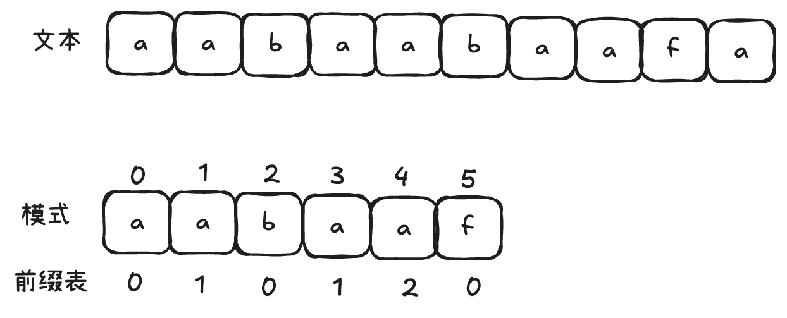

# 字符串

## 1.反转字符串

编写一个函数，其作用是将输入的字符串反转过来。不要给另外的数组分配额外的空间，你必须原地修改输入数组、使用 O(1) 的额外空间解决这一问题。你可以假设数组中的所有字符都是 ASCII 码表中的可打印字符。

```c++
#include<iostream>
#include<string>
using namespace std;
string reverseString(string s){
    int left=0;
    int right=s.size()-1;
    while(left<right){
        char temp;
        temp=s[left];
        s[left]=s[right];
        s[right]=temp;
        left++;
        right--;
    }
    return s;
}
int main(){
    string s="hello";
    cout<<reverseString(s);
} 
```

## 2.反转字符串02

给定一个字符串 s 和一个整数 k，从字符串开头算起, 每计数至 2k 个字符，就反转这 2k 个字符中的前 k 个字符。如果剩余字符少于 k 个，则将剩余字符全部反转。如果剩余字符小于 2k 但大于或等于 k 个，则反转前 k 个字符，其余字符保持原样。

示例:

输入: s = "abcdefg", k = 2
输出: "bacdfeg"

在遍历字符串的过程中，只要让 i += (2 * k)，i 每次移动 2 * k 就可以了，然后判断是否需要有反转的区间。因为要找的也就是每2 * k 区间的起点，这样写程序会高效很多.

```c++
#include<iostream>
#include<string>
using namespace std;
string reserveString(string s,int k){
    for(int i=0;i<s.size();i+=2*k){
        // 1. 每隔 2k 个字符的前 k 个字符进行反转
        // 2. 剩余字符小于 2k 但大于或等于 k 个，则反转前 k 个字符
        if (i + k <= s.size()) {
                reverse(s.begin() + i, s.begin() + i + k );
        } else {
                // 3. 剩余字符少于 k 个，则将剩余字符全部反转。
                reverse(s.begin() + i, s.end());
        }
    }
    return s;
}
int main(){
    string s="abcdefg";
    int k=2;
    cout<<reserveString(s,k);
}
```


## 3.替换数字

给定一个字符串 s，它包含小写字母和数字字符，请编写一个函数，将字符串中的字母字符保持不变，而将每个数字字符替换为number。

例如，对于输入字符串 "a1b2c3"，函数应该将其转换为 "anumberbnumbercnumber"。

对于输入字符串 "a5b"，函数应该将其转换为 "anumberb"

输入：一个字符串 s,s 仅包含小写字母和数字字符。

输出：打印一个新的字符串，其中每个数字字符都被替换为了number

样例输入：a1b2c3

样例输出：anumberbnumbercnumber 

```c++
#include<iostream>
#include<string>
using namespace std;

string replaceNum(string s) {
    int count = 0;
    for (char c : s) {
        if (isdigit(c)) {
            count++;
        }
    }
    
    int oldSize = s.size();
    s.resize(s.size() + count * 5);
    int oldIndex = oldSize - 1;
    int newIndex = s.size() - 1;
    
    while (oldIndex >= 0) {
        if (isdigit(s[oldIndex])) {
            s[newIndex--] = 'r';
            s[newIndex--] = 'e';
            s[newIndex--] = 'b';
            s[newIndex--] = 'm';
            s[newIndex--] = 'u';
            s[newIndex--] = 'n';
        } else {
            s[newIndex--] = s[oldIndex];
        }
        oldIndex--;
    }
    
    return s;
}

int main() {
    string s = "a1b2c3";
    string result = replaceNum(s);
    cout << result;  // 输出: anumberbnumbercnumber
}
```


## 4.翻转字符串的单词

给定一个字符串，逐个翻转字符串中的每个单词。**不要使用辅助空间，空间复杂度要求为O(1)。**

示例 1：
输入: "the sky is blue"
输出: "blue is sky the"

示例 2：
输入: "  hello world!  "
输出: "world! hello"
解释: 输入字符串可以在前面或者后面包含多余的空格，但是反转后的字符不能包括。

示例 3：
输入: "a good  example"
输出: "example good a"
解释: 如果两个单词间有多余的空格，将反转后单词间的空格减少到只含一个。

所以解题思路如下：

- 移除多余空格
- 将整个字符串反转
- 将每个单词反转

```c++
#include<iostream>
#include<string>
#include <algorithm>
using namespace std;

string reverseString(string s) {
    int left = 0;
    int right = s.size() - 1;
    while (left < right) {
        swap(s[left], s[right]);
        left++;
        right--;
    }
    return s;
}

string removespace(string s) {
    int slow = 0;
    for (int i = 0; i < s.size(); ++i) { 
        if (s[i] != ' ') {
            if (slow != 0) s[slow++] = ' ';
            while (i < s.size() && s[i] != ' ') {
                s[slow++] = s[i++];
            }
        }
    }
    s.resize(slow);
    return s;
}

string reverseSentence(string s) {
    s = removespace(s);
    s = reverseString(s);
    int start = 0;
    for (int i = 0; i <= s.size(); ++i) {
        if (i == s.size() || s[i] == ' ') {
            reverse(s.begin() + start, s.begin() + i);
            start = i + 1;
        }
    }
    return s;
}

int main() {
    string test = "the sky is blue";
    string result = reverseSentence(test);
    cout << result << endl; // 应该输出: "blue is sky the"
    return 0;
}
```


## 5.右旋字符串

字符串的右旋转操作是把字符串尾部的若干个字符转移到字符串的前面。给定一个字符串 s 和一个正整数 k，请编写一个函数，将字符串中的后面 k 个字符移到字符串的前面，实现字符串的右旋转操作。

例如，对于输入字符串 "abcdefg" 和整数 2，函数应该将其转换为 "fgabcde"。

输入：输入共包含两行，第一行为一个正整数 k，代表右旋转的位数。第二行为字符串 s，代表需要旋转的字符串。

输出：输出共一行，为进行了右旋转操作后的字符串。


```c++
#include<iostream>
#include<string>
#include<algorithm>
using namespace std;
string reverseString(string s) {
    int left = 0;
    int right = s.size() - 1;
    while (left < right) {
        swap(s[left], s[right]);
        left++;
        right--;
    }
    return s;
}
string turnright(string s,int k){
    //整体反转
    s=reverseString(s);
    //划分反转
    reverse(s.begin(),s.begin()+k);
    reverse(s.begin()+k,s.end());
    return s;
}
int main(){
    string s="abcdefg";
    int k=2;
    cout<<turnright(s,k);
}
```

注意：为了让本题更有意义，提升一下本题难度：**不能申请额外空间，只能在本串上操作**。

## 6.实现strStr()

实现 strStr() 函数。

给定一个 haystack 字符串和一个 needle 字符串，在 haystack 字符串中找出 needle 字符串出现的第一个位置 (从0开始)。如果不存在，则返回 -1。

示例 1: 输入: haystack = "hello", needle = "ll" 输出: 2

示例 2: 输入: haystack = "aaaaa", needle = "bba" 输出: -1

说明: 当 needle 是空字符串时，我们应当返回什么值呢？这是一个在面试中很好的问题。 对于本题而言，当 needle 是空字符串时我们应当返回 0 。这与C语言的 strstr() 以及 Java的 indexOf() 定义相符。

本题是KMP 经典题目。我们写完这题可以扩展一下：给定一个文本t和一个字符串s，我们尝试找到并展示s在t中的所有出现位置。

```c++
#include<iostream>
#include<string>
using namespace std;
//暴力算法
int force(string s, string t) {
    int n = s.size();
    int m = t.size();
    for (int i = 0; i <= n - m; i++) {
        bool match = true;
        for (int j = 0; j < m; j++) {
            if (t[j] != s[i + j]) {
                match = false;
                break;
            }
        }
        if (match) {
            return i;
        }
    }
    return -1; // 没有找到返回-1
}

int main() {
    string a = "ababababf";
    string b = "ababf";
    cout << force(a, b); // 输出3
    return 0;
}
```

字符串匹配的暴力算法非常简单，就是两层for循环，但是KMP算法较为复杂，我们需要很多的前置知识。

KMP的主要思想是**当出现字符串不匹配时，可以知道一部分之前已经匹配的文本内容，可以利用这些信息避免从头再去做匹配。**如何记录已经匹配的文本内容，是next数组来实现的。next数组就是一个前缀表（prefix table）。**前缀表是用来回退的，它记录了模式串与主串(文本串)不匹配的时候，模式串应该从哪里开始重新匹配。**如：要在文本串：aabaabaafa 中查找是否出现过一个模式串：aabaaf。可以看出，文本串中第六个字符b 和 模式串的第六个字符f，不匹配了。如果暴力匹配，发现不匹配，此时就要从头匹配了。但如果使用前缀表，就不会从头匹配，而是从上次已经匹配的内容开始匹配，找到了模式串中第三个字符b继续开始匹配。那么**前缀表是如何记录的呢？**首先前缀表的任务是当前位置匹配失败，找到之前已经匹配上的位置，再重新匹配，此也意味着在某个字符失配时，前缀表会告诉你下一步匹配中，模式串应该跳到哪个位置。那么前缀表就是：**记录下标i之前（包括i）的字符串中，有多大长度的相同前缀后缀。**

文中字符串的**前缀是指不包含最后一个字符的所有以第一个字符开头的连续子串**。**后缀是指不包含第一个字符的所有以最后一个字符结尾的连续子串**。**因为前缀表要求的就是相同前后缀的长度。**所以字符串a的最长相等前后缀为0。 字符串aa的最长相等前后缀为1。 字符串aaa的最长相等前后缀为2。 等等.....。



找到的不匹配的位置， 那么此时我们要看它的前一个字符的前缀表的数值是多少。前一个字符的前缀表的数值是2， 所以把下标移动到下标2的位置继续比配。 最后就在文本串中找到了和模式串匹配的子串了。

很多KMP算法的实现都是使用next数组来做回退操作，next数组就可以是前缀表，但是很多实现都是把前缀表右移一位，初始位置为-1之后作为next数组。其实**这并不涉及到KMP的原理，而是具体实现，next数组既可以就是前缀表，也可以是前缀表统一减一（右移一位，初始位置为-1）。**后面我会提供两种不同的实现代码。

```c++
//kmp算法
//统一减1的next数组
void getNext(int* next, const string& s){
    //定义两个指针i和j，j指向前缀末尾位置，i指向后缀末尾位置。
    int j = -1;
    next[0] = j;//然后还要对next数组进行初始化赋值
    for(int i = 1; i < s.size(); i++) { // 注意i从1开始
        while (j >= 0 && s[i] != s[j + 1]) { // 前后缀不相同了
            j = next[j]; // 向前回退
        }
        if (s[i] == s[j + 1]) { // 找到相同的前后缀
            j++;
        }
        next[i] = j; // 将j（前缀的长度）赋给next[i]
    }
}
int kmp(string haystack, string needle){
    if (needle.size() == 0) {
            return 0;
        }
		vector<int> next(needle.size());
		getNext(&next[0], needle);
        int j = -1; // // 因为next数组里记录的起始位置为-1
        for (int i = 0; i < haystack.size(); i++) { // 注意i就从0开始
            while(j >= 0 && haystack[i] != needle[j + 1]) { // 不匹配
                j = next[j]; // j 寻找之前匹配的位置
            }
            if (haystack[i] == needle[j + 1]) { // 匹配，j和i同时向后移动
                j++; // i的增加在for循环里
            }
            if (j == (needle.size() - 1) ) { // 文本串s里出现了模式串t
                return (i - needle.size() + 1);
            }
        }
        return -1;
}
//next数组不减1的实现方式
void getNext01(int* next, const string& s) {
        int j = 0;
        next[0] = 0;
        for(int i = 1; i < s.size(); i++) {
            while (j > 0 && s[i] != s[j]) {
                j = next[j - 1];
            }
            if (s[i] == s[j]) {
                j++;
            }
            next[i] = j;
        }
}
int strStr01(string haystack, string needle) {
        if (needle.size() == 0) {
            return 0;
        }
        vector<int> next(needle.size());
        getNext01(&next[0], needle);
        int j = 0;
        for (int i = 0; i < haystack.size(); i++) {
            while(j > 0 && haystack[i] != needle[j]) {
                j = next[j - 1];
            }
            if (haystack[i] == needle[j]) {
                j++;
            }
            if (j == needle.size() ) {
                return (i - needle.size() + 1);
            }
        }
        return -1;
    }
int main() {
    string a = "ababababf";
    string b = "ababf";
    cout << strStr01(a, b); // 输出3
    return 0;
}
```

## 7.重复的字符串

给定一个非空的字符串，判断它是否可以由它的一个子串重复多次构成。给定的字符串只含有小写英文字母，并且长度不超过10000。

示例 1:

- 输入: "abab"
- 输出: True
- 解释: 可由子字符串 "ab" 重复两次构成。

示例 2:

- 输入: "aba"
- 输出: False

示例 3:

- 输入: "abcabcabcabc"
- 输出: True
- 解释: 可由子字符串 "abc" 重复四次构成。 (或者子字符串 "abcabc" 重复两次构成。)

本题也是kmp的应用。

```c++
#include<iostream>
#include<string>
using namespace std;
bool repeatedSubstringPattern(string s) {
    string t = s + s;
    t.erase(t.begin()); t.erase(t.end() - 1); // 掐头去尾
    if (t.find(s) != string::npos) return true; // r
    return false;
}

int main(){
    string s="abcab";
    cout<<repeatedSubstringPattern(s);
}
```

1. **核心思想**：
   如果字符串`s`可以由子串`sub`重复`k`次构成（如`"abab" = "ab" + "ab"`），那么将两个`s`连接后（`t = s + s`），再移除`t`的首尾字符，剩余部分**一定包含完整的`s`**。这是因为移除首尾字符后，`t`的中间部分会暴露出一个完整的重复结构。
2. **数学证明简述**：
   设`s = sub * k`（`k > 1`），长度为`n`。
   - `t = s + s` 的长度为`2n`。
   - 移除首尾字符后，`t`的长度变为`2n - 2`。
   - 此时`t`的子串区间`[1, n]`（0-based索引）恰好是`s[1..n-1] + sub[0..n-1]`，由于`s`的重复性，**该区间必然包含完整的`s`**。
3. **非重复字符串的情况**：
   如果`s`不能由子串重复构成（如`"abc"`），则修改后的`t`中不会包含完整的`s`。

**以输入 `s = "abcab"` 为例演示步骤**

1. **步骤1：创建 `t = s + s`**
   - `s = "abcab"`
   - `t = "abcab" + "abcab" = "abcababcab"`
2. **步骤2：删除 `t` 的第一个字符**
   - 删除开头的 `'a'` → `t = "bcababcab"`
3. **步骤3：删除 `t` 的最后一个字符**
   - 删除结尾的 `'b'` → `t = "bcababca"`（长度从10变为8）
4. **步骤4：在 `t` 中搜索 `s`**
   - 在 `"bcababca"` 中搜索 `"abcab"`：
     - 所有子串检查：
       - `[0:4] = "bcab"` → 不匹配
       - `[1:5] = "caba"` → 不匹配
       - `[2:6] = "abab"` → 不匹配
       - `[3:7] = "babc"` → 不匹配（需5字符，`"babc"`仅4字符）
     - **未找到匹配** → `find()` 返回 `string::npos`。
5. **返回值**
   - 函数返回 `false` → 程序输出 `0`。

**其他示例验证**

1. **成功案例（`s = "abab"`）**：
   - `t = "abababab"`
   - 删除首尾 → `"bababa"`
   - 在 `"bababa"` 中找到 `"abab"`（位置索引1）→ 返回 `true`。
2. **失败案例（`s = "abc"`）**：
   - `t = "abcabc"`
   - 删除首尾 → `"bcab"`
   - 在 `"bcab"` 中找不到 `"abc"` → 返回 `false`。

**边界情况处理**

- **空字符串**：`s = ""` → `t` 也为空，`find()` 返回 `npos` → `false`（合理）。
- **单字符**：`s = "a"` → `t = "aa"` → 删除首尾后为空 → 找不到 `"a"` → `false`（单字符无法重复）。
- **全相同字符**：`s = "aaa"` → `t = "aaaaaa"` → 删除首尾 → `"aaaa"` → 包含 `"aaa"` → `true`（由 `"a"` 重复3次）。

其中：

- `string::npos` 是一个表示"未找到"的特殊值（通常是 `size_t` 类型的最大值）
- 这个比较是在检查 `s` 是否存在于 `t` 中
- 如果找到（返回值不是 `npos`），条件成立，返回 `true`
- 如果未找到，条件不成立，继续执行返回 `false`

对于kmp算法

```c++
void getNext (int* next, const string& s){
        next[0] = -1;
        int j = -1;
        for(int i = 1;i < s.size(); i++){
            while(j >= 0 && s[i] != s[j + 1]) {
                j = next[j];
            }
            if(s[i] == s[j + 1]) {
                j++;
            }
            next[i] = j;
        }
    }
    bool repeatedSubstringPattern (string s) {
        if (s.size() == 0) {
            return false;
        }
        int next[s.size()];
        getNext(next, s);
        int len = s.size();
        if (next[len - 1] != -1 && len % (len - (next[len - 1] + 1)) == 0) {
            return true;
        }
        return false;
    }
```

- **next 数组含义**：`next[i]` 表示子串 `s[0..i]` 的 **最长相等前后缀长度减 1**（即前缀末尾下标）
- **核心逻辑**：
  1. 当字符不匹配时：`while` 循环让 `j` 回退（利用已计算的 next 值）
  2. 当字符匹配时：`j` 和 `i` 共同前进
  3. 记录当前位置的 next 值：`next[i] = j`

**关键逻辑：**

```c++
if (next[len - 1] != -1 && len % (len - (next[len - 1] + 1)) == 0)
```

1. **`next[len - 1] != -1`**：
   - 表示整个字符串存在 **非平凡**（长度 > 0）的相等前后缀
   - 如果等于 -1，说明没有公共前后缀，肯定不是重复子串构成
2. **`len - (next[len - 1] + 1)`**：
   - `next[len - 1] + 1` = 整个字符串的最长相等前后缀长度
   - `len - 最长前后缀长度` = **重复子串的长度**（记为 `L`）
3. **`len % L == 0`**：
   - 检查字符串长度是否能被重复子串长度整除
   - 整除意味着字符串可由该子串重复多次构成