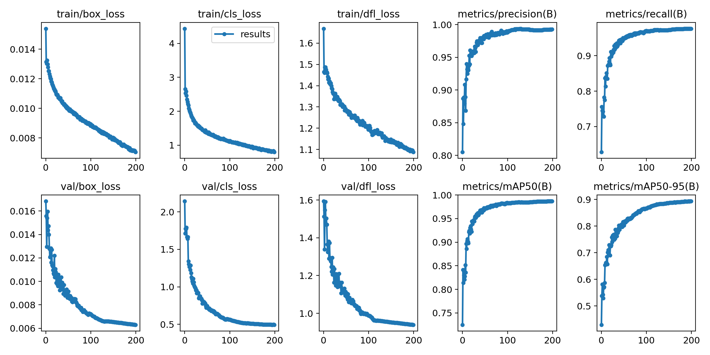
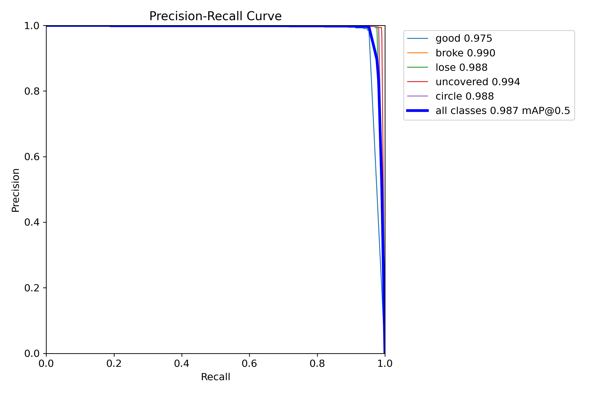
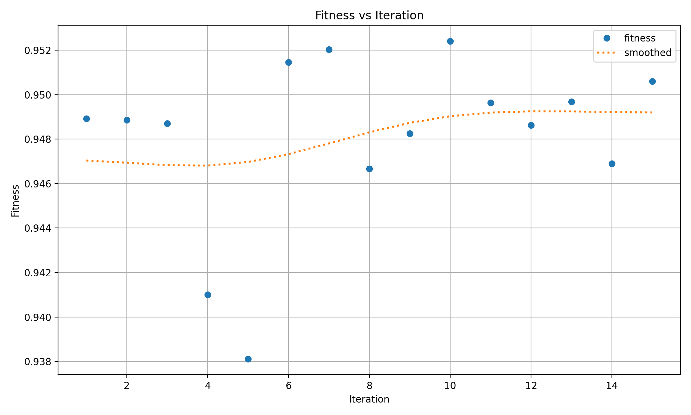
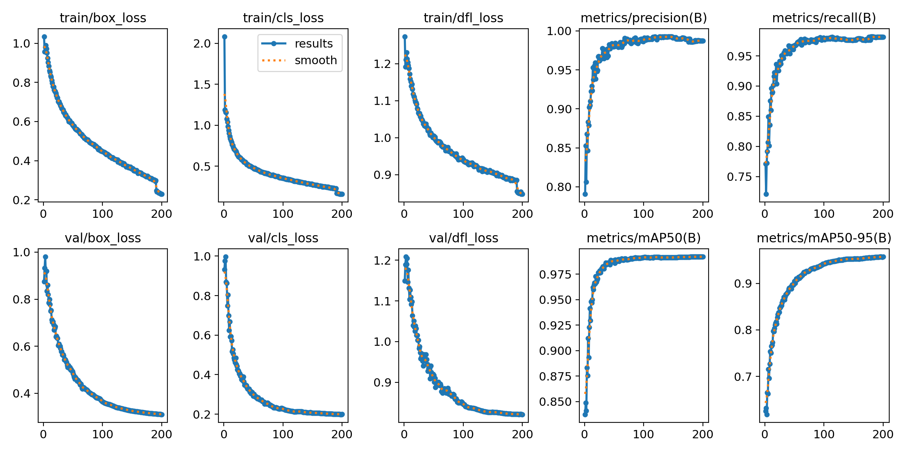
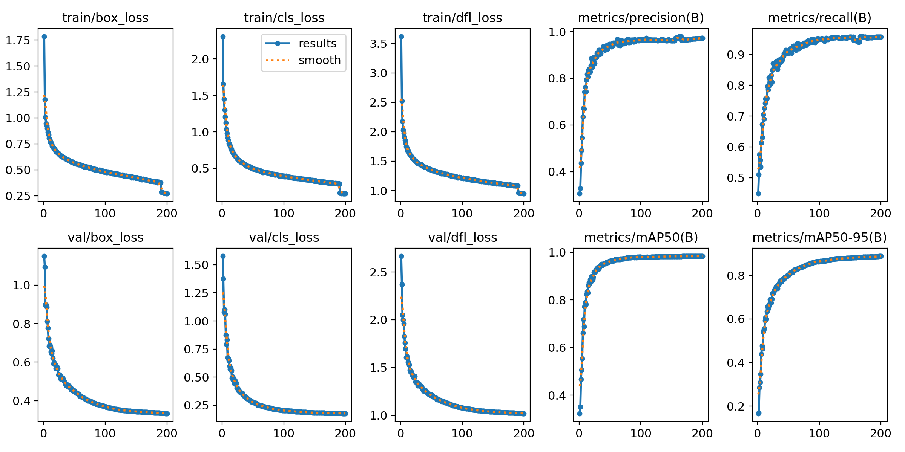
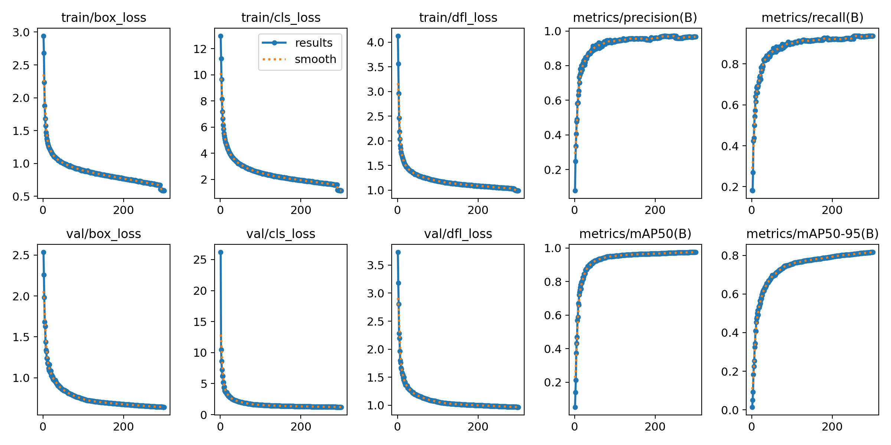

# 第一次实验
在实验中，我们基于数据集的特征和经验设计了一些超参数，展开第一次初始的训练得到了可供我们进行性能对比的基准结果。我们训练的设置如下：
```python
import warnings
warnings.filterwarnings('ignore')
from ultralytics import YOLO
# 加载模型
model = YOLO('yolov8m.pt')
# 开始训练任务
model.train(data="/data/coding/rec/data.yaml",
            epochs=200, 
            batch=16, 
            imgsz=640, 
            lr0=0.005, 
            device=0,
            weight_decay=0.0005,
            name='yolov8s_eucalyptus_advanced',
            # 可以使用focal loss处理类别不平衡
            augment=True,  # 启用数据增强
            #fl_loss=1.5,  # focal loss gamma参数
            # 增加分类损失的权重，帮助更好区分背景
            cls=1,
            box=0.08,
            iou=0.45,
            conf=0.5,
            hsv_h=0.1,  # 色调增强
            hsv_s=0.7,  # 饱和度增强
            hsv_v=0.4,  # 明度增强
            degrees=15.0,  # 旋转角度范围
            translate=0.1,  # 平移范围
            scale=0.5,  # 缩放范围
            shear=2.0,  # 剪切范围
            flipud=0.5,  # 上下翻转概率
            fliplr=0.5,  # 左右翻转概率
            mosaic=1.0,  # mosaic数据增强概率
            mixup=0.1,  # mixup数据增强概率
            copy_paste=0.5  # 随机粘贴背景
            )

```
并且得到了如下的结果：

我们可以看出来训练集和验证集上这个模型损失函数的收敛都是不错的，而且精度和召回率都接近1，验证集上的mAP50接近1，mAP50-95接近0.9，是个效果很好的模型。说到mAP，就不得不提到一些重要的性能指标。

|          | true | false |
|:--------:|:----:|:-----:|
| positive | TP   | FN    |
| negative | FP   | TN    |

YOLO中有如下的阈值：

置信度阈值：对每个预测框的置信度分数的标准。模型会为每个预测框提供一个置信度值（例如目标的存在概率），表示模型认为该框包含目标的信心有多大。一般都是pr(object)与IoU的乘积，Pr(Object) 是边界框内存在对象的概率。如果边界框内有对象，则Pr(Object)=1；反之，则Pr(Object)=0。

IoU阈值：IoU衡量的是两个区域重叠的程度。预测框与真实框的IoU大于等于某个阈值时，才认为这个预测是有效的，工业领域一般为0.5。IOU方法比较简单直观，计算两个边界框的交集与并集之间的比值。当IoU接近1时，意味着两个边界框高度重叠，即预测的位置与真实位置高度一致；当IoU接近0时，表示两个边界框几乎没有重叠，即预测偏离真实位置很大。 IoU的计算方式如下：确定两个边界框的坐标表示形式。计算两个边界框的交集面积：将两个边界框的区域进行重叠，计算重叠部分的面积。计算两个边界框的并集面积：将两个边界框的区域进行合并，计算合并后的面积。计算IoU：将交集面积除以并集面积，得到IoU的值。
这里两个阈值，在我看来IoU阈值决定定位严格性，而置信度是由IoU阈值计算得到的，决定了精确度与召回率的平衡。

YOLO中有如下相对单一的评价指标（即真正例、假反例、假正例、真反例）：

P：精确率，对类A来说：P = TP / TP+FP

R：召回率，对类A来说：R = TP / TP+FN

这里插入举个例子以便理解：某个模型要对动物进行分类，分为猫与非猫两类。样本中猫有350份，非猫有150份。预测出了400份被认为是猫，其中，正确的有300份，错误的有100份。则P = 300 / 400 = 0.75，R = 300 / 350 ≈ 0.86。接上文，提高置信度阈值会导致FP减少，TP可能减少，从而精确度上升，召回率下降。降低置信度阈值导致TP增加，FP也增加从而召回率上升，精确度下降。提高IoU阈值会导致TP减少（定位要求更严）从而精确度和召回率均可能下降。

下面是几种综合性的评判方法：

F1 score：是P与R的调和平均，F1 = 2PR / (P + R)。相应的也有F2、F0.5，这取决于应用场景中你认为召回率和精确度哪个更重要。

P-R曲线：这个精确率-召回率曲线，是以召回率为横轴，精确率为纵轴，将精确率和召回率连接起来形成一条曲线。

通过观察精确率-召回率曲线，我们就可以根据具体问题选择合适的阈值，从而在精确率和召回率之间进行权衡。比如在一些情况下，更高的精确率可能更重要，而在另一些情况下，更高的召回率可能更为关键。

AP：平均准确率，是对不同召回率点上的准确率进行平均，在PR曲线图上表现为PR曲线下面的面积。AP的值越大，则说明模型的平均准确率越高。

mAP：平均精度均值，这个词听起来有些拗口，我们来仔细捋一捋。上面我们知道了什么是AP，AP就是PR曲线下面的面积（如下图），是指不同召回率下的精度的平均值。然而，在我们的目标检测任务中，一个模型检测到四种类别，且如上图所示，每一类都能绘制一个PR曲线，进而计算出一个AP值。那么多个类别的AP值的平均就是mAP。可以看出，mAP针对整个数据集而言的，AP针对数据集中某一个类别而言的，而percision和recall针对单张图片的。

mAP50与mAP50-95：将IoU设为0.5时，计算每一类的所有图片的AP，然后所有类别求平均，即mAP50。表示在IoU从0.5到0.95，步长0.05，即IoU=0.5、0.55、0.6、0.65、0.7、0.75、0.8、0.85、0.9、0.95上的平均mAP。
# 第二次实验
我们像进一步优化模型在更严苛的阈值下的表现，我们于是用YOLO官方给出的方法进行寻优：
```python
import warnings
warnings.filterwarnings('ignore')
from ultralytics import YOLO
if __name__ == '__main__':
    model = YOLO('/data/coding/runs/detect/yolov8s_eucalyptus_advanced/weights/best.pt')      # 需要修改
    model.load('yolov8n.pt') # loading pretrain weights
    model.tune(data=r'/data/coding/rec/data.yaml',
                epochs=50,
                batch=32,
                close_mosaic=10,
                device='0',
                optimizer="SGD",
                workers=8,# 数据加载线程数（建议=CPU核心数）
                pretrained=True,# 启用预训练权重加速收敛
                project='runs/train',
                iterations=15,
                name='exp',
                plots=False,
                )
```
得到寻优的结果：


取第十次的超参数进行训练的设置：
```python
import warnings
warnings.filterwarnings('ignore')
from ultralytics import YOLO
 
# 加载模型
model = YOLO('yolov8m.pt')
# 开始训练任务
model.train(data="/data/coding/rec/data.yaml",
            epochs=200, 
            batch=16, 
            imgsz=640,
            name='yolov8s_eucalyptus_advanced',
            lr0= 0.01066,
            lrf= 0.00988,
            momentum= 0.88938,
            weight_decay= 0.00045,
            warmup_epochs= 3.63717,
            warmup_momentum= 0.88001,
            box= 7.8841,
            cls= 0.59704,
            dfl= 1.52442,
            hsv_h= 0.01474,
            hsv_s= 0.5951,
            hsv_v= 0.40185,
            degrees= 0.0,
            translate= 0.10077,
            scale= 0.63505,
            shear= 0.0,
            perspective= 0.0,
            flipud= 0.0,
            fliplr= 0.44332,
            bgr= 0.0,
            mosaic= 0.98881,
            mixup= 0.0,
            copy_paste= 0.0
            )
```
我们可以得到训练的结果如下所示：

它在验证集上的mAP50-95的表现实际上是更好的，但是它和第一次训练的模型在其他指标上相差不大，出现这样的现象实际上也很好理解，mAP50-95是多个IoU 阈值下平均精度的均值，反映了模型在不同严格程度下的定位能力。即使精确率和召回率在单一阈值下变化不大，若模型在更高IoU阈值如 0.75、0.9）下的性能得到提升，就会显著拉高 mAP50-95。也就是大家在普通指标上效果差不多，而在更严格的指标上后者的提升多，就出现这样的现象。
# 第三次实验
添加注意力机制后训练：
注意力机制一直是很热门的优化方法，我们也尝试了这个方法尝试对自己的模型优化，我们首先是对YOLO的代码进行了一些改动，ultralytics/nn目录下，建SEAttention.py文件，在ultralytics/nn/tasks.py中需要加入SEAttention文件，在ultralytics/nn/task.py中对parse_model函数进行调整，加入SE注意力模型解析，通过SEAtt_yolov8.yaml在我们的工程里面加入注意力机制到骨干网最后部分。

其中SEAttention.py如下：
```python
import numpy as np
import torch
from torch import nn
from torch.nn import init

class SEAttention(nn.Module):

    def __init__(self, channel=512,reduction=16):
        super().__init__()
        self.avg_pool = nn.AdaptiveAvgPool2d(1)
        self.fc = nn.Sequential(
            nn.Linear(channel, channel // reduction, bias=False),
            nn.ReLU(inplace=True),
            nn.Linear(channel // reduction, channel, bias=False),
            nn.Sigmoid()
        )

    def init_weights(self):
        for m in self.modules():
            if isinstance(m, nn.Conv2d):
                init.kaiming_normal_(m.weight, mode='fan_out')
                if m.bias is not None:
                    init.constant_(m.bias, 0)
            elif isinstance(m, nn.BatchNorm2d):
                init.constant_(m.weight, 1)
                init.constant_(m.bias, 0)
            elif isinstance(m, nn.Linear):
                init.normal_(m.weight, std=0.001)
                if m.bias is not None:
                    init.constant_(m.bias, 0)

    def forward(self, x):
        b, c, _, _ = x.size()
        y = self.avg_pool(x).view(b, c)
        y = self.fc(y).view(b, c, 1, 1)
        return x * y.expand_as(x)

```
ultralytics/nn/tasks.py要做如下的修改：
```python
from ultralytics.nn.SEAttention import SEAttention
```
找到该文件下的parse_model函数，添加：
```python
elif m in {SEAttention}:
    args=[ch[f],*args]
```
创建SEAtt_yolov8.yaml如下：
```python
# Ultralytics YOLO ?, AGPL-3.0 license
# YOLOv8 object detection model with P3-P5 outputs. For Usage examples see https://docs.ultralytics.com/tasks/detect

# Parameters
nc: 5  # number of classes
scales: # model compound scaling constants, i.e. 'model=yolov8n.yaml' will call yolov8.yaml with scale 'n'
  # [depth, width, max_channels]
  n: [0.33, 0.25, 1024]  # YOLOv8n summary: 225 layers,  3157200 parameters,  3157184 gradients,   8.9 GFLOPs
  s: [0.33, 0.50, 1024]  # YOLOv8s summary: 225 layers, 11166560 parameters, 11166544 gradients,  28.8 GFLOPs
  m: [0.67, 0.75, 768]   # YOLOv8m summary: 295 layers, 25902640 parameters, 25902624 gradients,  79.3 GFLOPs
  l: [1.00, 1.00, 512]   # YOLOv8l summary: 365 layers, 43691520 parameters, 43691504 gradients, 165.7 GFLOPs
  x: [1.00, 1.25, 512]   # YOLOv8x summary: 365 layers, 68229648 parameters, 68229632 gradients, 258.5 GFLOPs

# YOLOv8.0n backbone
backbone:
  # [from, repeats, module, args]
  - [-1, 1, Conv, [64, 3, 2]]  # 0-P1/2
  - [-1, 1, Conv, [128, 3, 2]]  # 1-P2/4
  - [-1, 3, C2f, [128, True]]
  - [-1, 1, Conv, [256, 3, 2]]  # 3-P3/8
  - [-1, 6, C2f, [256, True]]
  - [-1, 1, Conv, [512, 3, 2]]  # 5-P4/16
  - [-1, 6, C2f, [512, True]]
  - [-1, 1, Conv, [1024, 3, 2]]  # 7-P5/32
  - [-1, 3, C2f, [1024, True]]
  - [-1, 1, SPPF, [1024, 5]]  # 9
  - [-1, 1, SEAttention, [16]]

# YOLOv8.0n head
head:
  - [-1, 1, nn.Upsample, [None, 2, 'nearest']]
  - [[-1, 6], 1, Concat, [1]]  # cat backbone P4
  - [-1, 3, C2f, [512]]  # 12

  - [-1, 1, nn.Upsample, [None, 2, 'nearest']]
  - [[-1, 4], 1, Concat, [1]]  # cat backbone P3
  - [-1, 3, C2f, [256]]  # 15 (P3/8-small)

  - [-1, 1, Conv, [256, 3, 2]]
  - [[-1, 13], 1, Concat, [1]]  # cat head P4
  - [-1, 3, C2f, [512]]  # 18 (P4/16-medium)

  - [-1, 1, Conv, [512, 3, 2]]
  - [[-1, 10], 1, Concat, [1]]  # cat head P5
  - [-1, 3, C2f, [1024]]  # 21 (P5/32-large)

  - [[16, 19, 22], 1, Detect, [nc]]  # Detect(P3, P4, P5)
```
然后我们设置训练参数如下：
```python
import warnings
warnings.filterwarnings('ignore')
from ultralytics import YOLO
# 加载预训练模型
# 添加注意力机制，SEAtt_yolov8.yaml 默认使用的是n。
# SEAtt_yolov8s.yaml，则使用的是s，模型。
model = YOLO("ultralytics/cfg/models/v8/SEAtt_yolov8.yaml").load('yolov8n.pt')
# Use the model
if __name__ == '__main__':
    # Use the model
    results = model.train(data='/data/coding/ultralytics/data.yaml', 
    epochs=200, 
    batch=16,
    name='attention',
    imgsz=640, 
    # 超参数示例（部分）
    lr0=3e-4,  # 初始学习率
    lrf=0.01,   # 最终学习率（余弦退火）
    weight_decay=0.0005,
    warmup_epochs=5, 
    iou=0.45,
    augment=True,  # 启用默认增强（Mosaic/MixUp等）
    hsv_h=0.015,  # 色调增强强度
    hsv_s=0.7,    # 饱和度增强强度
    hsv_v=0.4,    # 亮度增强强度
    box=7.0,  # 框回归损失权重
    cls=1.5,  # 分类损失权重（可增至1.5抑制误检）
    )  # 训练模型
```
可以得到结果如下：

结果依然是不错的，但是mAP50-95就有些不尽如人意，但是我们在部署此模型到边缘设备时，这种方法给FPS带来了巨大的提升。应该是SE模块主要由全局平均池化（GAP）+ 两个全连接层（FC）组成，计算量远小于卷积层。而边缘设备（如Jetson、树莓派）的CPU/GPU更适合执行轻量级FC运算，而SE的GAP+FC计算效率较高。且SE模块默认使用压缩比（reduction ratio，如16），大幅减少FC层的参数量。例如：输入通道数=256 → 中间层=256/16=16 → 输出通道数=256，计算量远低于普通卷积。总之就是两句话：一是动态进行特征选择调整特征权重，抑制了不重要特征，减少了无效的传播，也就减少了冗余计算。二是用更轻量级的结构替代了原来的复杂结构。
# 第四次实验
主干网络替换为FasterNet是在超低性能设备上部署模型的常规方法：
将 FasterNet 的核心代码添加到 ultralytics/nn/modules/bock.py 中，并且在该文件的最上方引用‘BasicStage’、‘PatchEmbed_FasterNet’、‘PatchMerging_FasterNet’模块。在ultralytics/nn/modules/init.py与ultralytics/nn/tasks.py中添加上述三个模块，同时在tasks.py的parse_model解析函数中添加FasterNet的解析模块，在self.model.modules函数后添加激活FasterNet的模块。最后添加创建yolov8-FasterNet.yaml文件。

bock.py：
```python
__all__ = (
    "DFL","HGBlock","HGStem","SPP","SPPF","C1","C2","C3","C2f",
    "C2fAttn","ImagePoolingAttn","ContrastiveHead","BNContrastiveHead",
    "C3x","C3TR","C3Ghost","GhostBottleneck","Bottleneck","BottleneckCSP",
    "Proto","RepC3","ResNetLayer","RepNCSPELAN4","ELAN1","ADown","AConv",
    "SPPELAN","CBFuse","CBLinear","C3k2","C2fPSA","C2PSA","RepVGGDW",
    "CIB","C2fCIB","Attention","PSA","SCDown","TorchVision","BasicStage",
    "PatchEmbed_FasterNet","PatchMerging_FasterNet"
)
# --------------------------FasterNet----------------------------
from timm.models.layers import DropPath


class Partial_conv3(nn.Module):
    def __init__(self, dim, n_div, forward):
        super().__init__()
        self.dim_conv3 = dim // n_div
        self.dim_untouched = dim - self.dim_conv3
        self.partial_conv3 = nn.Conv2d(self.dim_conv3, self.dim_conv3, 3, 1, 1, bias=False)

        if forward == 'slicing':
            self.forward = self.forward_slicing
        elif forward == 'split_cat':
            self.forward = self.forward_split_cat
        else:
            raise NotImplementedError

    def forward_slicing(self, x):
        # only for inference
        x = x.clone()  # !!! Keep the original input intact for the residual connection later
        x[:, :self.dim_conv3, :, :] = self.partial_conv3(x[:, :self.dim_conv3, :, :])

        return x

    def forward_split_cat(self, x):
        # for training/inference
        x1, x2 = torch.split(x, [self.dim_conv3, self.dim_untouched], dim=1)
        x1 = self.partial_conv3(x1)
        x = torch.cat((x1, x2), 1)
        return x


class MLPBlock(nn.Module):
    def __init__(self,
                 dim,
                 n_div,
                 mlp_ratio,
                 drop_path,
                 layer_scale_init_value,
                 act_layer,
                 norm_layer,
                 pconv_fw_type
                 ):

        super().__init__()
        self.dim = dim
        self.mlp_ratio = mlp_ratio
        self.drop_path = DropPath(drop_path) if drop_path > 0. else nn.Identity()
        self.n_div = n_div

        mlp_hidden_dim = int(dim * mlp_ratio)
        mlp_layer = [
            nn.Conv2d(dim, mlp_hidden_dim, 1, bias=False),
            norm_layer(mlp_hidden_dim),
            act_layer(),
            nn.Conv2d(mlp_hidden_dim, dim, 1, bias=False)
        ]
        self.mlp = nn.Sequential(*mlp_layer)
        self.spatial_mixing = Partial_conv3(
            dim,
            n_div,
            pconv_fw_type
        )
        if layer_scale_init_value > 0:
            self.layer_scale = nn.Parameter(layer_scale_init_value * torch.ones((dim)), requires_grad=True)
            self.forward = self.forward_layer_scale
        else:
            self.forward = self.forward

    def forward(self, x):
        shortcut = x
        x = self.spatial_mixing(x)
        x = shortcut + self.drop_path(self.mlp(x))
        return x

    def forward_layer_scale(self, x):
        shortcut = x
        x = self.spatial_mixing(x)
        x = shortcut + self.drop_path(
            self.layer_scale.unsqueeze(-1).unsqueeze(-1) * self.mlp(x))
        return x


class BasicStage(nn.Module):
    def __init__(self,
                 dim,
                 depth=1,
                 n_div=4,
                 mlp_ratio=2,
                 layer_scale_init_value=0,
                 norm_layer=nn.BatchNorm2d,
                 act_layer=nn.ReLU,
                 pconv_fw_type='split_cat'
                 ):
        super().__init__()
        dpr = [x.item()
               for x in torch.linspace(0, 0.0, sum([1, 2, 8, 2]))]
        blocks_list = [
            MLPBlock(
                dim=dim,
                n_div=n_div,
                mlp_ratio=mlp_ratio,
                drop_path=dpr[i],
                layer_scale_init_value=layer_scale_init_value,
                norm_layer=norm_layer,
                act_layer=act_layer,
                pconv_fw_type=pconv_fw_type
            )
            for i in range(depth)
        ]

        self.blocks = nn.Sequential(*blocks_list)

    def forward(self, x):
        x = self.blocks(x)
        return x


class PatchEmbed_FasterNet(nn.Module):

    def __init__(self, in_chans, embed_dim, patch_size, patch_stride, norm_layer=nn.BatchNorm2d):
        super().__init__()
        self.proj = nn.Conv2d(in_chans, embed_dim, kernel_size=patch_size, stride=patch_stride, bias=False)
        if norm_layer is not None:
            self.norm = norm_layer(embed_dim)
        else:
            self.norm = nn.Identity()

    def forward(self, x):
        x = self.norm(self.proj(x))
        return x

    def fuseforward(self, x):
        x = self.proj(x)
        return x


class PatchMerging_FasterNet(nn.Module):

    def __init__(self, dim, out_dim, k, patch_stride2, norm_layer=nn.BatchNorm2d):
        super().__init__()
        self.reduction = nn.Conv2d(dim, out_dim, kernel_size=k, stride=patch_stride2, bias=False)
        if norm_layer is not None:
            self.norm = norm_layer(out_dim)
        else:
            self.norm = nn.Identity()

    def forward(self, x):
        x = self.norm(self.reduction(x))
        return x

    def fuseforward(self, x):
        x = self.reduction(x)
        return x
```
init.py：
```python
from .block import (....,BasicStage,PatchEmbed_FasterNet,PatchMerging_FasterNet)
tasks.py：
from ultralytics.nn.modules import (....BasicStage, PatchEmbed_FasterNet, PatchMerging_FasterNet)
base_modules = frozenset(
        {
            ....
            BasicStage,
            PatchEmbed_FasterNet,
            PatchMerging_FasterNet
        }
    )
....
#约1472行
        elif m in [BasicStage]:
            args.pop(1)
....
#在self.model.modules()添加
        if type(m) is PatchEmbed_FasterNet:
            m.proj = fuse_conv_and_bn(m.proj, m.norm)
            delattr(m, 'norm')  # remove BN
            m.forward = m.fuseforward
        if type(m) is PatchMerging_FasterNet:
            m.reduction = fuse_conv_and_bn(m.reduction, m.norm)
            delattr(m, 'norm')  # remove BN
            m.forward = m.fuseforward
```
yolov8-FasterNet.yaml：
```python
# Ultralytics YOLO 🚀, AGPL-3.0 license
# YOLOv8 object detection model with P3-P5 outputs. For Usage examples see https://docs.ultralytics.com/tasks/detect

# Parameters
nc: 5  # number of classes
scales: # model compound scaling constants, i.e. 'model=yolov8n.yaml' will call yolov8.yaml with scale 'n'
  # [depth, width, max_channels]
  n: [0.33, 0.25, 1024]  # YOLOv8n summary: 225 layers,  3157200 parameters,  3157184 gradients,   8.9 GFLOPs
  s: [0.33, 0.50, 1024]  # YOLOv8s summary: 225 layers, 11166560 parameters, 11166544 gradients,  28.8 GFLOPs
  m: [0.67, 0.75, 768]   # YOLOv8m summary: 295 layers, 25902640 parameters, 25902624 gradients,  79.3 GFLOPs
  l: [1.00, 1.00, 512]   # YOLOv8l summary: 365 layers, 43691520 parameters, 43691504 gradients, 165.7 GFLOPs
  x: [1.00, 1.25, 512]   # YOLOv8x summary: 365 layers, 68229648 parameters, 68229632 gradients, 258.5 GFLOPs

# YOLOv8.0n backbone
backbone:
  # [from, repeats, module, args]
  - [-1, 1, PatchEmbed_FasterNet, [40, 4, 4]]  # 0-P1/4
  - [-1, 1, BasicStage, [40, 1]]  # 1
  - [-1, 1, PatchMerging_FasterNet, [80, 2, 2]]  # 2-P2/8
  - [-1, 2, BasicStage, [80, 1]]  # 3-P3/16
  - [-1, 1, PatchMerging_FasterNet, [160, 2, 2]]  # 4
  - [-1, 8, BasicStage, [160, 1]]  # 5-P4/32
  - [-1, 1, PatchMerging_FasterNet, [320, 2, 2]] # 6
  - [-1, 2, BasicStage, [320, 1]] # 7
  - [-1, 1, SPPF, [320, 5]]  # 8


# YOLOv8.0n head
head:
  - [-1, 1, nn.Upsample, [None, 2, 'nearest']]
  - [[-1, 5], 1, Concat, [1]]  # cat backbone P4
  - [-1, 1, C2f, [512]]  # 11

  - [-1, 1, nn.Upsample, [None, 2, 'nearest']]
  - [[-1, 3], 1, Concat, [1]]  # cat backbone P3
  - [-1, 1, C2f, [256]]  # 14 (P3/8-small)

  - [-1, 1, Conv, [256, 3, 2]]
  - [[-1, 11], 1, Concat, [1]]  # cat head P4
  - [-1, 1, C2f, [512]]  # 17 (P4/16-medium)

  - [-1, 1, Conv, [512, 3, 2]]
  - [[-1, 8], 1, Concat, [1]]  # cat head P5
  - [-1, 1, C2f, [1024]]  # 20 (P5/32-large)

  - [[14, 17, 20], 1, Detect, [nc]]  # Detect(P3, P4, P5)
```
我们设置训练参数如下：
```python
import warnings
warnings.filterwarnings('ignore')
from ultralytics import YOLO
if __name__ == '__main__':
    model = YOLO('/data/coding/ultralytics/ultralytics/cfg/models/v8/yolov8-FasterNet.yaml')
    model.load('yolov8n.pt') # loading pretrain weights
    model.train(data='/data/coding/ultralytics/data.yaml', 
                epochs=300, 
                batch=16,
                patience=20,
                name='main',
                # 超参数示例（部分）
                lr0=3e-4,  # 初始学习率
                lrf=0.01,   # 最终学习率（余弦退火）
                weight_decay=0.0005,
                warmup_epochs=5, 
                iou=0.45,
                augment=True,  # 启用默认增强（Mosaic/MixUp等）
                hsv_h=0.015,  # 色调增强强度
                hsv_s=0.7,    # 饱和度增强强度
                hsv_v=0.4,    # 亮度增强强度
                box=7.0,  # 框回归损失权重
                cls=1.5,  # 分类损失权重（可增至1.5抑制误检）
                )
```
得到的训练结果如下：

除了mAP50-95的表现不佳，我们依然有很好的性能表现，而且在超低性能的边缘设备上的表现及其优秀。
